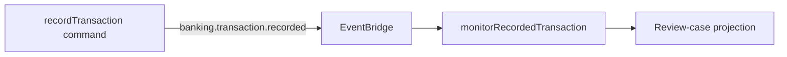

The banking service records a transaction. A separate monitoring service decides
whether that fact needs a review signal. The transaction command never calls the
monitoring repository directly.

The rule is deliberately small: a EUR transaction of at least `100000` minor
units opens an in-memory `review-required` case. It is a training signal, not
money-laundering detection and it never takes adverse action against an account.

1. [Generate the monitoring boundary](/tutorials/transaction-monitoring/run-the-producer/)
2. [Publish the transaction fact](/tutorials/transaction-monitoring/publish-an-event/)
3. [Generate and wire the subscription](/tutorials/transaction-monitoring/add-a-subscription/)
4. [Apply the training rule](/tutorials/transaction-monitoring/apply-the-training-rule/)
5. [Make repeated delivery safe](/tutorials/transaction-monitoring/handle-event-repeats/)
6. [Test monitoring](/tutorials/transaction-monitoring/test-monitoring/)

The runnable reference is `examples/banking/src/service.ts` and
`examples/banking/src/advanced/service.ts`.

Next: [generate the monitoring boundary](/tutorials/transaction-monitoring/run-the-producer/).
