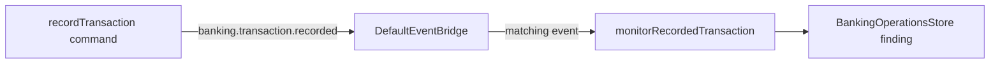

A transaction service should record a transaction. A monitoring concern should
decide separately whether that fact needs attention. This chapter shows that
split with one PURISTA event and one subscription.

The example uses a training threshold: a recorded EUR transaction of at least
`100000` minor units creates an in-memory `review-required` finding. It is not
money-laundering detection and it does not take action against an account.



The producer is in `examples/banking/src/service.ts`. The event contract and
subscription are in `examples/banking/src/advanced/`. Both start in the same
local process through `examples/banking/src/index.ts`.

## Start here

No Docker service is required for this checkpoint. `DefaultEventBridge` keeps
the example local and in memory, so it does not prove durable publication,
replay, or recovery after a process restart.

```bash title="Run the focused banking tests"
npm run test -w @purista/banking-tutorials
```

The test suite checks the subscription function with a high-value synthetic
event. A focused HTTP integration test also proves that Erin, the assigned
reviewer for account A, can read its review case while Bob receives `403`.
There is no monitoring screen in the browser UI yet; use the test or the
guarded `GET /api/v1/review-cases/account-a` endpoint to inspect this result.

1. [Run the local producer](/tutorials/transaction-monitoring/run-the-producer/)
2. [Publish a transaction event](/tutorials/transaction-monitoring/publish-an-event/)
3. [Add a monitoring subscription](/tutorials/transaction-monitoring/add-a-subscription/)
4. [Apply the training rule](/tutorials/transaction-monitoring/apply-the-training-rule/)
5. [Handle repeated events](/tutorials/transaction-monitoring/handle-event-repeats/)
6. [Test transaction monitoring](/tutorials/transaction-monitoring/test-monitoring/)
