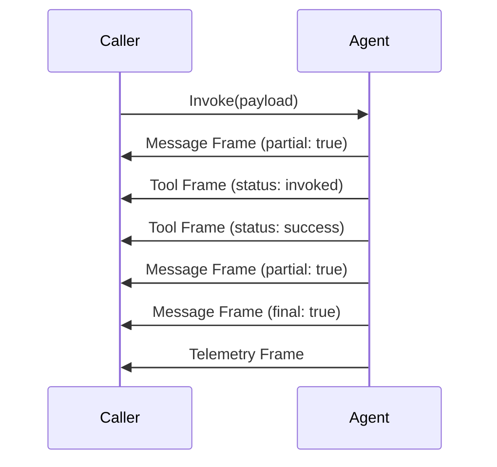

# AI Protocol (Advanced View)

The PURISTA Agent Protocol is a structured way for agents and callers to communicate over the EventBridge. It uses a series of **Frames** wrapped in **Envelopes**.

This protocol is designed to:
- Keep agents as "black boxes" (decoupling implementation from interface).
- Capture nested flows (agent-to-agent calls, tool chains).
- Be transformable to other ecosystems (MCP, A2A, Vercel AI SDK).
- Preserve PURISTA transport semantics (trace IDs, tenant/principal propagation).

## 1. The Envelope

Every piece of communication from an agent is wrapped in an `AgentProtocolEnvelope`.

- **`agentName` / `serviceVersion`**: The source of the frame.
- **`sessionId`**: The stable conversation identity.
- **`tenantId` / `principalId`**: Security and separation metadata.
- **`frame`**: The actual payload of the communication.

## 2. Frame Kinds

The `frame` property of the envelope defines **what** is being communicated.

### A. Message Frame (`kind: 'message'`)
Carries the actual text response from the LLM.
- **`role`**: `assistant` or `user`.
- **`content`**: The text content (can be a delta or full).
- **`partial`**: `true` if this is a chunk of a larger message.
- **`final`**: `true` if this completes the turn.

### B. Artifact Frame (`kind: 'artifact'`)
Used for non-textual data, like structured JSON, code snippets, or UI hints.
- **`artifactId`**: Unique ID for this artifact.
- **`mimeType`**: e.g., `application/json` or `text/javascript`.
- **`content`**: The raw artifact data.

### C. Tool Event Frame (`kind: 'tool'`)
Automatically emitted when an agent calls a PURISTA command.
- **`toolName`**: The full path to the command.
- **`status`**: `invoked`, `success`, or `error`.
- **`args`**: The input payload to the tool.
- **`result`**: The output of the tool (on success).

### D. Telemetry Frame (`kind: 'telemetry'`)
Sent at the end of a run to provide operational insights.
- **`durationMs`**: Total time taken.
- **`usage`**: Token counts (`prompt`, `completion`, `total`).
- **`poolMetrics`**: Concurrency data (`activeWorkers`, `waitingWorkers`).

### E. Error Frame (`kind: 'error'`)
Sent when something goes wrong (LLM failure, tool failure, schema violation).
- **`code`**: A machine-readable error code.
- **`message`**: A human-readable description.
- **`handled`**: `true` if the error was expected.

## 3. The Stream Life-cycle

When you call an agent, you receive a stream of these frames.



## 4. Custom Transforms

If you need to transform these frames for a non-PURISTA client (e.g., a legacy mobile app), you can iterate through the invocation:

```ts
const invocation = context.invokeAgent.supportAgent['1'].call(payload)

for await (const envelope of invocation) {
  const frame = envelope.frame
  if (frame.kind === 'message') {
    // Transform message frame to your custom format
  }
}
```

---

### Why a custom protocol?
By using a structured, frame-based protocol instead of a raw text stream, PURISTA allows your agents to be **observational** (telemetry), **action-oriented** (tools), and **rich** (artifacts), all while maintaining a single, consistent communication channel.
