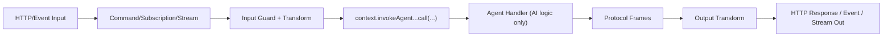

# The Agent Builder

`new AgentBuilder(...)` mirrors `ServiceBuilder`: you define one agent workload with typed input/output, allowlisted tools, model aliases, and runtime behavior.

Think of this page as the practical handbook entry:

1. create/scaffold
2. define a minimal useful agent
3. add features (tools/history/knowledge/http)
4. wire runtime config in bootstrap

## 1) Scaffold with CLI

```bash
purista add agent SupportAgent
```

This creates:

- `src/agents/supportAgent/v1/supportAgent.ts`
- `src/agents/supportAgent/v1/supportAgent.test.ts`

## 2) Minimal agent first

```ts title="src/agents/supportAgent/v1/supportAgent.ts"
import { AgentBuilder } from '@purista/ai'
import { extendApi } from '@purista/core'
import { z } from 'zod/v4'

const supportInputSchema = extendApi(
  z.object({
    sessionId: z.string().uuid().optional(),
    prompt: z.string().min(1),
    context: z.string().optional(),
  }),
  { title: 'Support Agent Input' },
)

export const supportAgent = new AgentBuilder({
  agentName: 'supportAgent',
  agentVersion: '1',
  description: 'Answers help-desk questions',
})
  .addPayloadSchema(supportInputSchema)
  .defineModel('openai:gpt-4o-mini')
  .setHandler(async function (context, payload) {
    const model = context.models['openai:gpt-4o-mini']
    const result = await model.generate({ prompt: payload.prompt, context: payload.context })
    context.stream.sendFinal(result.output)
    return { message: result.output }
  })
  .build()
```

Start simple like this, then add advanced features incrementally.

## 3) Add one capability at a time

After the minimal handler works, add only the features your workload needs.

### 3.1 Allowlist command tools

```ts
const supportAgent = new AgentBuilder({
  agentName: 'supportAgent',
  agentVersion: '1',
  description: 'Answers help-desk questions',
})
  .allowTool({
    serviceName: 'ticketing',
    serviceVersion: '1',
    commandName: 'createTicket',
  })
  .setHandler(async function (context, payload) {
    if (payload.prompt.includes('open ticket')) {
      await context.tools.invoke('ticketing.1.createTicket', { reason: payload.prompt })
    }
    context.stream.sendFinal('Done')
    return { message: 'Done' }
  })
  .build()
```

Only allowlisted commands are available to the handler.

### 3.2 Add conversation persistence

```ts
const supportAgent = new AgentBuilder({ ... })
  .persistConversation('user', { maxFrames: 40 })
  .setHandler(async function (context, payload) {
    await context.conversation.addUser(payload.prompt)
    const prompt = await context.conversation.buildPromptInput()

    const result = await context.models['openai:gpt-4o-mini'].generate({ prompt })
    await context.conversation.addAssistant(result.output)

    context.stream.sendFinal(result.output)
    return { message: result.output }
  })
  .build()
```

Use `'user'` for fuller transcript-style memory and `'agent'` for compact summary-oriented memory.

### 3.3 Connect a knowledge adapter

```ts
const supportAgent = new AgentBuilder({ ... })
  .useKnowledgeAdapter('supportFaq')
  .setHandler(async function (context, payload) {
    const docs = await context.knowledge.supportFaq.query(payload.prompt, { limit: 3 })
    const contextBlock = docs.map(doc => doc.content).join('\n')
    const result = await context.models['openai:gpt-4o-mini'].generate({
      prompt: `${payload.prompt}\n\nContext:\n${contextBlock}`,
    })
    context.stream.sendFinal(result.output)
    return { message: result.output }
  })
  .build()
```

### 3.4 Expose HTTP endpoint

```ts
const supportAgent = new AgentBuilder({ ... })
  .exposeAsHttpEndpoint('POST', 'agents/supportAgent') // SSE default
  .setHandler(...)
  .build()
```

Configure pool identity and worker count at runtime bootstrap (`getInstance(..., { poolConfig: { poolId, maxWorkers } })`).

## 4) Quick method map

- schema methods (`.addPayloadSchema`, `.addParameterSchema`, `.addOutputSchema`) reuse normal Purista schema primitives.
- `.defineModel(alias)` declares allowed model aliases; provider instances are injected at runtime.
- `.setRetryPolicy(...)` mirrors command/queue retry behavior and emits handled/unhandled protocol errors automatically.

## 5) Builder configuration reference

### Identity & schema

| Method | Options | Use when | Trade-off |
| --- | --- | --- | --- |
| `new AgentBuilder({ agentName, agentVersion, description })` | strings | always | naming becomes public API surface |
| `addPayloadSchema(schema)` | Purista schema | always | strict validation can reject malformed callers early |
| `addParameterSchema(schema)` | Purista schema | optional | extra contract clarity vs additional schema maintenance |
| `addOutputSchema(schema)` | Purista schema | optional | stronger guarantees for downstream callers |

### Models & tools

| Method | Options | Use when | Trade-off |
| --- | --- | --- | --- |
| `defineModel(alias)` | model alias string | agent should use model provider | aliases must be satisfied at runtime |
| `allowTool({ serviceName, serviceVersion, commandName })` | command address | agent may call existing commands | explicit allowlists require setup but improve security |

### Conversation & knowledge

| Method | Options | Use when | Trade-off |
| --- | --- | --- | --- |
| `persistConversation('user', overrides?)` | `maxFrames`, `strategy`, `storeName` | interactive chat memory | larger context can increase token usage |
| `persistConversation('agent', overrides?)` | `maxFrames`, `strategy`, `storeName` | background/long workflows | summary compression may lose very fine detail |
| `useKnowledgeAdapter('alias', options?)` | adapter alias + adapter options | RAG / FAQ / document lookup | requires runtime adapter provisioning |

### Runtime behavior & exposure

| Method | Options | Use when | Trade-off |
| --- | --- | --- | --- |
| `setRetryPolicy({ maxAttempts, strategy, delayMs })` | retry policy | transient model/tool failures expected | retries improve resilience but can add latency |
| `exposeAsHttpEndpoint(method, path, ...)` | HTTP config | endpoint should be reachable via API | public API stability commitment |
| `setStreamingMode('sse' \| 'chunked' \| 'buffered')` | stream mode | non-default transport behavior needed | buffered hides incremental progress |

## Handler context breakdown

The handler receives a familiar context object with agent-specific helpers:

| Property | Description |
| --- | --- |
| `logger`, `message`, `serviceContext` | Same observability handles you use inside services. |
| `stream` | Action-oriented streaming helpers that map to the [agent protocol](./protocol-and-streaming.md): `sendChunk`, `sendFinal`, `sendReasoning`, `sendArtifact`, `sendError`. |
| `conversation` | High-level chat history API (`addUser`, `addAssistant`, `buildPromptInput`, `getMessages`) with automatic session scoping and optional summary support. |
| `session` | Low-level session store wrapper (`load`, `save`, `delete`) for advanced/custom state handling. |
| `knowledge` | Fan-out to configured knowledge adapters (`query/upsert/delete`), with automatic tenant/principal/session scope propagation. |
| `tools` | Invoke allowlisted PURISTA commands. Events appear as tool frames for tracing/debugging. |
| `models` | Typed access to declared model aliases (`context.models[alias]`). |
| `resources` | Optional custom dependencies for non-model integrations (caches, SDK clients, domain utilities). |

Use these helpers instead of manually wiring protocol IDs, storing envelopes, or calling commands by hand. The builder/runtime ensure every handler runs with consistent tracing, retries, and validation.

When you register aliases with `.useKnowledgeAdapter(...)`, handler access is strongly typed (`context.knowledge.<alias>`) and `getInstance(...)` requires matching `knowledgeAdapters` in TypeScript.

## Guards and transforms with agents

Agent handlers intentionally stay focused on AI business logic.  
Guard and transform behavior should be applied on the invoking edge (`command`, `subscription`, `stream`) using the standard PURISTA APIs.

## Why this pattern

- keeps agent code transport-agnostic and reusable
- reuses existing security model (authZ, tenancy, preconditions)
- keeps input/output mapping close to the caller contract (HTTP, event payload, stream frame)
- avoids duplicated guard logic when one agent is invoked from multiple entry points

## Execution flow



## Practical examples

### 1) Guard before invoking agent

```ts
export const runSupportAgentCommand = supportServiceBuilder
  .getCommandBuilder('runSupportAgent', 'Runs support agent with entitlement guard')
  .canInvokeAgent('supportAgent', '1', {
    payloadSchema: supportInvokePayloadSchema,
    parameterSchema: supportInvokeParameterSchema,
  })
  .addPayloadSchema(inputSchema)
  .setCommandFunction(async function (context, payload) {
    if (!context.message.principalId) {
      throw new Error('Principal required')
    }

    return context.invokeAgent.supportAgent['1']
      .call({ message: payload.prompt }, { channel: 'command', locale: payload.locale })
      .final()
  })
```

Use case: enforce tenant/user/security preconditions at the service edge.

### 2) Transform caller input to agent payload

```ts
setCommandFunction(async function (context, payload) {
  const normalizedPayload = {
    message: payload.question.trim(),
    context: payload.includeHistory ? payload.historySummary : undefined,
  }

  return context.invokeAgent.supportAgent['1']
    .call(normalizedPayload, { channel: 'command' })
    .final()
})
```

Use case: keep agent payload stable while external API contracts evolve.

### 3) Transform protocol frames for external consumers

```ts
setCommandFunction(async function (context, payload) {
  const invocation = context.invokeAgent.supportAgent['1']
    .call({ message: payload.prompt }, { channel: 'command' })

  const chunks: string[] = []
  for await (const envelope of invocation) {
    if (envelope.frame.kind === 'message') {
      chunks.push(envelope.frame.content)
    }
  }

  return { answer: chunks.join('') }
})
```

Use case: map protocol frames to REST/GraphQL/mobile-specific response shapes.

## Suggested placement rules

| Concern | Put it in |
| --- | --- |
| auth, tenancy, entitlement, business preconditions | invoking command/subscription/stream guard |
| shape mapping between external contract and agent payload | invoking command/subscription/stream transform |
| LLM prompt/tool/history orchestration | agent handler |
| protocol-to-client mapping (REST/SSE/WebSocket/UI) | invoking edge / transport adapter |

Following this split keeps the agent runtime generic while preserving the full PURISTA guard/transform model.
