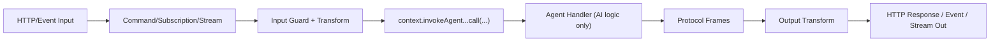

# The Agent Builder

`new AgentBuilder(...)` mirrors `ServiceBuilder`: you define one agent workload with typed input/output, invoked commands, model aliases, and runtime behavior.

Think of this page as the practical handbook entry:

1. create/scaffold
2. define a minimal useful agent
3. add features (tools/history/knowledge/http)
4. wire runtime config in bootstrap

## 1) Scaffold with CLI

```bash
purista add agent SupportAgent
```

This creates:

- `src/agents/supportAgent/v1/supportAgent.ts`
- `src/agents/supportAgent/v1/supportAgent.test.ts`

## 2) Minimal agent first

```ts title="src/agents/supportAgent/v1/supportAgent.ts"
import { AgentBuilder, generateText } from '@purista/ai'
import { extendApi } from '@purista/core'
import { z } from 'zod/v4'

const supportInputSchema = extendApi(
  z.object({
    sessionId: z.string().uuid().optional(),
    prompt: z.string().min(1),
    context: z.string().optional(),
  }),
  { title: 'Support Agent Input' },
)

export const supportAgent = new AgentBuilder({
  agentName: 'supportAgent',
  agentVersion: '1',
  description: 'Answers help-desk questions',
})
  .addPayloadSchema(supportInputSchema)
  .defineModel('openai:gpt-4o-mini')
  .setHandler(async function (context, payload) {
    const model = context.models['openai:gpt-4o-mini']
    const answer = await generateText({
      model,
      request: {
        prompt: payload.prompt,
        context: payload.context,
      },
      onTextDelta: delta => {
        if (delta.length > 0) {
          context.stream.sendChunk(delta)
        }
      },
    })
    context.stream.sendFinal(answer)
    return { message: answer }
  })
  .build()
```

Start simple like this, then add advanced features incrementally.

## 3) Add one capability at a time

After the minimal handler works, add only the features your workload needs.

### 3.1 Invoke commands and expose AI SDK tools

```ts
import { tool } from 'ai'
import { z } from 'zod/v4'

const createTicketPayloadSchema = z.object({
  reason: z.string().min(1),
})

const createTicketOutputSchema = z.object({
  ticketId: z.string().min(1),
  status: z.enum(['created']),
})

const supportAgent = new AgentBuilder({
  agentName: 'supportAgent',
  agentVersion: '1',
  description: 'Answers help-desk questions',
})
  .canInvoke('ticketing', '1', 'createTicket', createTicketOutputSchema, createTicketPayloadSchema)
  .setHandler(async function (context, payload) {
    const ticketTool = tool({
      description: 'Create a support ticket',
      inputSchema: createTicketPayloadSchema.extend({
        reason: z.string().min(1).describe('Why the ticket should be opened'),
      }),
      execute: async ({ reason }) =>
        await context.tools.invoke.ticketing['1'].createTicket({ reason }),
    })

    const answer = await context.models['openai:gpt-4o-mini'].generateText({
      prompt: payload.prompt,
      metadata: {
        aiSdk: {
          tools: { createTicket: ticketTool },
          toolChoice: 'auto',
        },
      },
    })

    return { message: answer }
  })
  .build()
```

Use `canInvoke(...)` for typed invoke contracts and AI SDK `tool(...)` for model-facing tools.
`tool({ inputSchema })` already validates/parses tool input for `execute`.
Tool results stay structured in the normal AI SDK loop; manual `JSON.stringify(...)` is only needed for custom logging/display channels.

If you stream manually with `context.stream.sendChunk(...)`, call `context.stream.sendFinal(...)` at the end of the turn.
If you do not stream manual chunks, returning `{ message: ... }` is sufficient.

### 3.1b Emit typed custom events from an agent

```ts
import { z } from 'zod/v4'

const supportAgent = new AgentBuilder({ ... })
  .canEmit(
    'support.ticket.classified',
    z.object({
      ticketId: z.string().min(1),
      urgency: z.enum(['low', 'medium', 'high']),
    }),
  )
  .setHandler(async function (context, payload) {
    await context.emit('support.ticket.classified', {
      ticketId: payload.ticketId,
      urgency: 'high',
    })
    return { message: 'Classification emitted.' }
  })
  .build()
```

### 3.1c Mark agent command result as an event (command pattern)

If you want the agent command response itself to be emitted as an event (same pattern as command builder “result as an event”), set a success event name:

```ts
const supportAgent = new AgentBuilder({
  agentName: 'supportAgent',
  agentVersion: '1',
  successEventName: 'support.agent.completed',
})
  .setHandler(async function () {
    return { message: 'Done.' }
  })
  .build()
```

Alternative:

```ts
const supportAgent = new AgentBuilder({ ... })
  .setSuccessEventName('support.agent.completed')
  .setHandler(async function () {
    return { message: 'Done.' }
  })
  .build()
```

### 3.2 Add structured `generateJson` path

```ts
import { z } from 'zod/v4'

const triageSchema = z.object({
  urgency: z.enum(['low', 'medium', 'high']),
  explanation: z.string().min(1),
})

const supportAgent = new AgentBuilder({ ... })
  .defineModel('openai:gpt-4o-mini', { capabilities: ['text', 'stream', 'json'] })
  .setHandler(async function (context, payload) {
    const result = await context.models['openai:gpt-4o-mini'].generateJson?.({
      prompt: `Classify: ${payload.prompt}`,
      schema: triageSchema,
    })

    const message = result
      ? `Urgency: ${result.data.urgency}\n${result.data.explanation}`
      : 'No classification available'

    context.stream.sendFinal(message)
    return { message }
  })
  .build()
```

### 3.3 Add conversation persistence

```ts
const supportAgent = new AgentBuilder({ ... })
  .persistConversation('user', { maxFrames: 40 })
  .setHandler(async function (context, payload) {
    await context.conversation.addUser(payload.prompt)
    const prompt = await context.conversation.buildPromptInput()

    const result = await context.models['openai:gpt-4o-mini'].generate({ prompt })
    await context.conversation.addAssistant(result.output)

    context.stream.sendFinal(result.output)
    return { message: result.output }
  })
  .build()
```

Use `'user'` for fuller transcript-style memory and `'agent'` for compact summary-oriented memory.

### 3.4 Connect a knowledge adapter

```ts
const supportAgent = new AgentBuilder({ ... })
  .useKnowledgeAdapter('supportFaq')
  .setHandler(async function (context, payload) {
    const docs = await context.knowledge.supportFaq.query(payload.prompt, { limit: 3 })
    const contextBlock = docs.map(doc => doc.content).join('\n')
    const result = await context.models['openai:gpt-4o-mini'].generate({
      prompt: `${payload.prompt}\n\nContext:\n${contextBlock}`,
    })
    context.stream.sendFinal(result.output)
    return { message: result.output }
  })
  .build()
```

### 3.5 Expose HTTP endpoint

```ts
const supportAgent = new AgentBuilder({ ... })
  .exposeAsHttpEndpoint('POST', 'agents/supportAgent') // SSE default
  .setHandler(...)
  .build()
```

Configure pool identity and worker count at runtime bootstrap (`getInstance(..., { poolConfig: { poolId, maxConcurrencyPerInstance } })`).

### 3.6 Configure dynamic model call options (`prepareCall` / `prepareStep`)

Use these hooks when model options must be derived per invocation step (for example temperature ramps, max token limits, or provider metadata tags).

```ts
const supportAgent = new AgentBuilder({ ... })
  .defineModel('openai:gpt-4o-mini')
  .setCallOptionsSchema(
    z.object({
      metadata: z.record(z.string(), z.unknown()).optional(),
      aiSdk: z.record(z.string(), z.unknown()).optional(),
    }),
  )
  .prepareStep(({ step, callKind }) => ({
    metadata: { callKind, step },
    aiSdk: {
      generate: {
        temperature: step <= 1 ? 0.1 : 0.3,
      },
    },
  }))
  .setHandler(async context => {
    const answer = await context.models['openai:gpt-4o-mini'].generateText?.({
      prompt: 'Summarize this ticket',
    })
    return { message: answer ?? '' }
  })
  .build()
```

Notes:

- `prepareCall` and `prepareStep` both run before each provider call.
- `setCallOptionsSchema(...)` validates hook output before it is merged into request metadata.
- `step` is 1-based and increments for every model call in the current agent run.

## 4) Quick method map

- schema methods (`.addPayloadSchema`, `.addParameterSchema`, `.addOutputSchema`) reuse normal Purista schema primitives.
- `.defineModel(alias)` declares allowed model aliases; provider instances are injected at runtime.
- `.setRetryPolicy(...)` mirrors command/queue retry behavior and emits handled/unhandled protocol errors automatically.

## 5) Builder configuration reference

### Identity & schema

| Method | Options | Use when | Trade-off |
| --- | --- | --- | --- |
| `new AgentBuilder({ agentName, agentVersion, description, successEventName? })` | strings | always | naming becomes public API surface |
| `addPayloadSchema(schema)` | Purista schema | always | strict validation can reject malformed callers early |
| `addParameterSchema(schema)` | Purista schema | optional | extra contract clarity vs additional schema maintenance |
| `addOutputSchema(schema)` | Purista schema | optional | stronger guarantees for downstream callers |

### Models & tools

| Method | Options | Use when | Trade-off |
| --- | --- | --- | --- |
| `defineModel(alias)` | model alias string | agent should use model provider | aliases must be satisfied at runtime |
| `canInvoke(serviceName, serviceVersion, commandName, outputSchema?, payloadSchema?, parameterSchema?)` | invoke target + optional schemas | agent should call other commands with typed access | clearer contracts require keeping invoke schemas aligned |
| `canEmit(eventName, payloadSchema)` | custom event name + payload schema | agent should emit typed domain events | event contracts must stay aligned with subscribers |
| `setSuccessEventName(eventName)` | event name for command success response | agent result should be consumable as event | this ties response semantics to event contract |
| `setCallOptionsSchema(schema)` | zod schema for hook output | enforce validated model call options | strict schemas reject malformed hook output at runtime |
| `prepareCall(fn)` | call hook | adjust metadata/options per model call | extra indirection if static defaults would be enough |
| `prepareStep(fn)` | step-aware call hook | implement iterative call-option policies | step logic can become hard to reason about if overused |

### Conversation & knowledge

| Method | Options | Use when | Trade-off |
| --- | --- | --- | --- |
| `persistConversation('user', overrides?)` | `maxFrames`, `strategy`, `storeName` | interactive chat memory | larger context can increase token usage |
| `persistConversation('agent', overrides?)` | `maxFrames`, `strategy`, `storeName` | background/long workflows | summary compression may lose very fine detail |
| `useKnowledgeAdapter('alias', options?)` | adapter alias + adapter options | RAG / FAQ / document lookup | requires runtime adapter provisioning |

### Runtime behavior & exposure

| Method | Options | Use when | Trade-off |
| --- | --- | --- | --- |
| `setRetryPolicy({ maxAttempts, strategy, delayMs })` | retry policy | transient model/tool failures expected | retries improve resilience but can add latency |
| `exposeAsHttpEndpoint(method, path, ...)` | HTTP config | endpoint should be reachable via API | public API stability commitment |
| `setStreamingMode('sse' \| 'chunked' \| 'buffered')` | stream mode | non-default transport behavior needed | buffered hides incremental progress |
| `setSseProtocol('purista' \| 'ai-sdk-responses' \| 'ai-sdk-ui-message' \| 'ai-sdk-data' \| 'ai-sdk-json-render' \| 'agent2agent' \| 'mcp')` | SSE wire protocol | endpoint consumer expects a specific protocol shape | protocol-specific stream shape may reduce generic client compatibility |

## Handler context breakdown

The handler receives a familiar context object with agent-specific helpers:

| Property | Description |
| --- | --- |
| `logger`, `message`, `serviceContext` | Same observability handles you use inside services. |
| `emit` | Typed custom-event emitter for events declared via `canEmit(...)`. |
| `stream` | Action-oriented streaming helpers that map to the [agent protocol](./protocol-and-streaming.md): `sendChunk`, `sendFinal`, `sendReasoning`, `sendArtifact`, `sendError`. |
| `conversation` | High-level chat history API (`addUser`, `addAssistant`, `buildPromptInput`, `getMessages`) with automatic session scoping and optional summary support. |
| `session` | Low-level conversation store wrapper (`load`, `save`, `delete`) for advanced/custom state handling. |
| `knowledge` | Fan-out to configured knowledge adapters (`query/upsert/delete`), with automatic tenant/principal/session scope propagation. |
| `tools` | Typed command invocations registered through `canInvoke(...)` and available as `context.tools.invoke.<service>['<version>'].<command>(...)`. |
| `models` | Typed access to declared model aliases (`context.models[alias]`). Prefer `generateText({ model, request, ... })` for one normalized stream-or-generate path. |
| `agents` | Subagent helpers (`invoke`, `runText`) for agent-to-agent orchestration without manual event bridge wiring. |
| `resources` | Optional custom dependencies for non-model integrations (caches, SDK clients, domain utilities). |

Use these helpers instead of manually wiring protocol IDs, storing envelopes, or calling commands by hand. The builder/runtime ensure every handler runs with consistent tracing, retries, and validation.

When you register aliases with `.useKnowledgeAdapter(...)`, handler access is strongly typed (`context.knowledge.<alias>`) and `getInstance(...)` requires matching `knowledgeAdapters` in TypeScript.

## Guards and transforms with agents

Agent handlers intentionally stay focused on AI business logic.  
Guard and transform behavior should be applied on the invoking edge (`command`, `subscription`, `stream`) using the standard PURISTA APIs.

## Why this pattern

- keeps agent code transport-agnostic and reusable
- reuses existing security model (authZ, tenancy, preconditions)
- keeps input/output mapping close to the caller contract (HTTP, event payload, stream frame)
- avoids duplicated guard logic when one agent is invoked from multiple entry points

## Execution flow



## Practical examples

### 1) Guard before invoking agent

```ts
export const runSupportAgentCommand = supportServiceBuilder
  .getCommandBuilder('runSupportAgent', 'Runs support agent with entitlement guard')
  .canInvokeAgent('supportAgent', '1', {
    payloadSchema: supportInvokePayloadSchema,
    parameterSchema: supportInvokeParameterSchema,
  })
  .addPayloadSchema(inputSchema)
  .setCommandFunction(async function (context, payload) {
    if (!context.message.principalId) {
      throw new Error('Principal required')
    }

    return context.invokeAgent.supportAgent['1']
      .call({ message: payload.prompt }, { channel: 'command', locale: payload.locale })
      .final()
  })
```

Use case: enforce tenant/user/security preconditions at the service edge.

### 2) Transform caller input to agent payload

```ts
setCommandFunction(async function (context, payload) {
  const normalizedPayload = {
    message: payload.question.trim(),
    context: payload.includeHistory ? payload.historySummary : undefined,
  }

  return context.invokeAgent.supportAgent['1']
    .call(normalizedPayload, { channel: 'command' })
    .final()
})
```

Use case: keep agent payload stable while external API contracts evolve.

### 3) Transform protocol frames for external consumers

```ts
setCommandFunction(async function (context, payload) {
  const invocation = context.invokeAgent.supportAgent['1']
    .call({ message: payload.prompt }, { channel: 'command' })

  const chunks: string[] = []
  for await (const envelope of invocation) {
    if (envelope.frame.kind === 'message') {
      chunks.push(envelope.frame.content)
    }
  }

  return { answer: chunks.join('') }
})
```

Use case: map protocol frames to REST/GraphQL/mobile-specific response shapes.

## Suggested placement rules

| Concern | Put it in |
| --- | --- |
| auth, tenancy, entitlement, business preconditions | invoking command/subscription/stream guard |
| shape mapping between external contract and agent payload | invoking command/subscription/stream transform |
| custom event emission (`canEmit`, domain events) | wherever domain truth is produced (agent handler via `context.emit(...)` or invoking edge) |
| LLM prompt/tool/history orchestration | agent handler |
| protocol-to-client mapping (REST/SSE/WebSocket/UI) | invoking edge / transport adapter |

Following this split keeps the agent runtime generic while preserving the full PURISTA guard/transform model.
