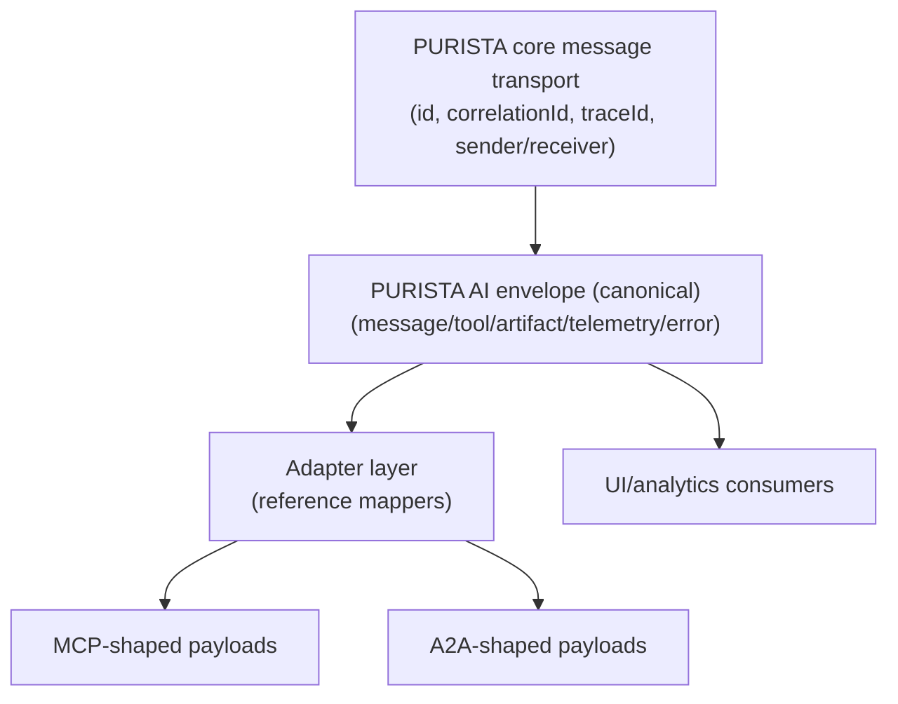
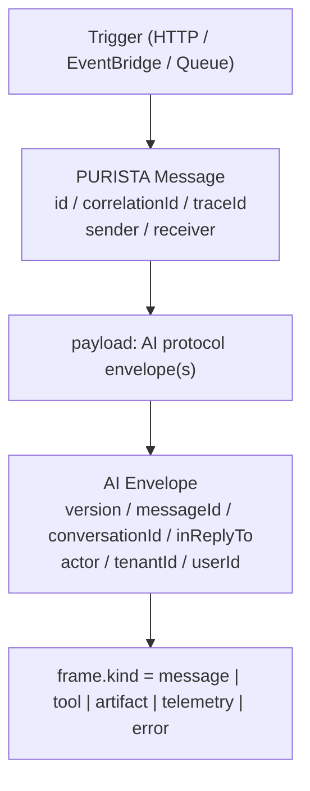
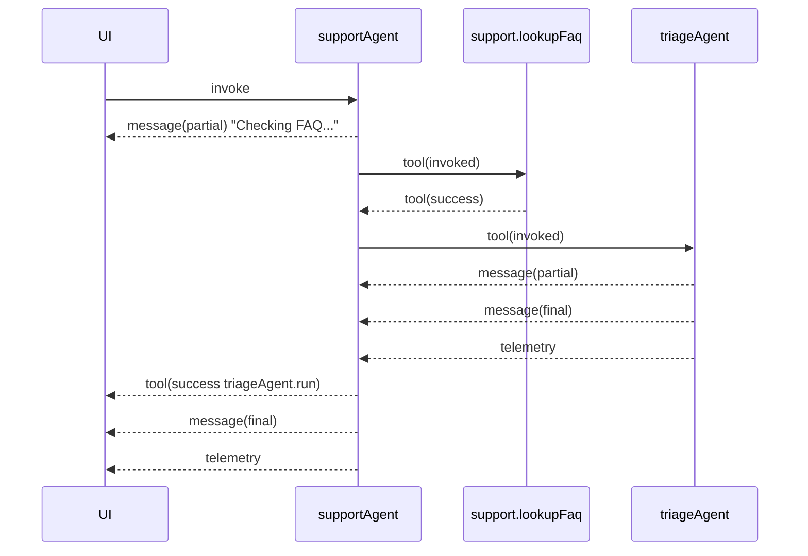
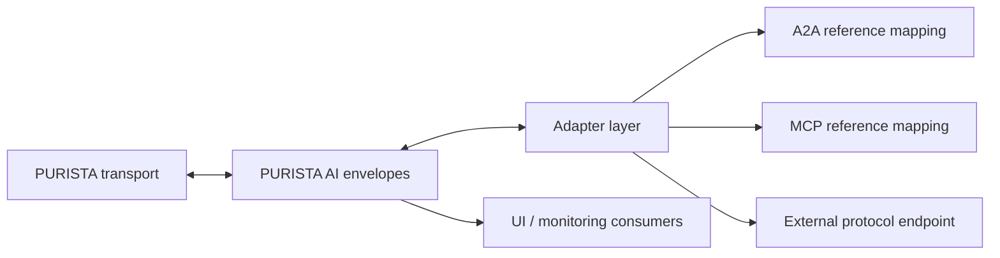

# AI Protocol

The PURISTA AI protocol is the frame format emitted by `@purista/ai` agent runtimes.

It exists to solve three core problems:

1. **Consistent runtime output** for command, stream, queue, and HTTP paths.
2. **Flow observability** for nested tool calls and agent-to-agent handoffs.
3. **Interop readiness** for MCP / A2A style boundaries through explicit adapters.

## Design principles

- Agent internals remain a black box (no protocol field can force tool execution decisions).
- Protocol rides on top of standard PURISTA message transport (it does not replace it).
- Correlation and identity come from PURISTA metadata and are preserved in envelopes.
- Consumers should usually parse and render envelopes, not construct them manually.

## Protocol relationship model

PURISTA has one canonical runtime protocol for AI flows. MCP and Agent2Agent are boundary views derived from it.



### Why this layering exists

- canonical runtime truth stays in one schema (`AgentProtocolEnvelope`)
- external protocol contracts can evolve without changing agent handlers
- nested tool/agent execution remains inspectable even when mapped to MCP/A2A
- protocol mappers are pure transforms (no tool execution control)

### Mapping ownership

| Concern | Owner |
| --- | --- |
| transport reliability, routing, auth, correlation IDs | PURISTA core |
| frame semantics (`message/tool/error/telemetry`) | PURISTA AI protocol |
| external protocol shape (MCP/A2A) | adapter commands/endpoints |
| rendering decisions (chat/workflow dashboards) | frontend/consumer |

## Layering model (PURISTA message + AI frame payload)

The runtime emits protocol envelopes as payload inside standard PURISTA messages:



This keeps transport concerns in PURISTA core while AI state and rendering concerns stay in the AI package.

## Envelope fields

Each emitted envelope contains metadata plus one frame. Core fields:

- `version`
- `messageId`
- `conversationId`
- `inReplyTo`
- `timestamp`
- `actor` (`service`, `version`, optional `agent`, optional `instanceId`)
- `userId` / `tenantId` (when available)
- `frame`

### Correlation mapping

| Concern | PURISTA message field | AI envelope field |
| --- | --- | --- |
| request identity | `id` | `inReplyTo` |
| stream/thread grouping | `correlationId` | `conversationId` |
| caller identity | `sender.*` | `actor.*` |
| tenant / principal scope | optional message metadata | `tenantId` / `userId` |

## Frame kinds

| Kind | Purpose | Typical consumer action |
| --- | --- | --- |
| `message` | Partial/final text output | render assistant text |
| `tool` | Tool lifecycle (`invoked/success/error`) | show timeline/tool panels |
| `artifact` | Structured output chunks | render JSON/file widgets |
| `telemetry` | usage + duration + provider + pool | capture metrics/observability |
| `error` | handled/unhandled error data | show failure UI + diagnostics |

### Telemetry frame fields

`telemetry` frames include:

- `usage` (`promptTokens`, `completionTokens`, `totalTokens`, optional `costUsd`)
- `durationMs`
- `waitTimeMs`
- `poolId`
- `maxWorkersPerInstance`
- `activeWorkers`
- `waitingWorkers`
- optional host hints: `replicaCountHint`, `effectiveMaxConcurrencyHint`
- `provider`

## Nested runs and why this protocol helps

When an agent invokes tools and sub-agents, you get a timeline like:



This gives frontend and ops systems enough structure to visualize and trace the flow, while keeping model/tool selection logic internal to the agent implementation.

## How handlers emit protocol safely

Most agent handlers should use `context.stream` helpers:

```ts
context.stream.sendChunk('Thinking...')
context.stream.sendFinal(answer)
context.stream.sendArtifact({ artifactId: 'citations', content: { ids: ['doc-1'] }, final: true })
```

Tool invocation should go through allowlisted helper calls:

```ts
const ticket = await context.tools.invoke('support.1.createTicket', { title: 'Refund request' })
```

The runtime automatically emits tool frames, telemetry, and error frames.

## Frontend consumer reference flow

A lightweight consumer loop is:

1. receive SSE chunks
2. parse each chunk as `agentProtocolEnvelopeSchema[]`
3. route by `frame.kind`
4. render timeline grouped by `conversationId` + `inReplyTo`

```ts
import { agentProtocolEnvelopeSchema } from '@purista/ai'

const envelopes = agentProtocolEnvelopeSchema.array().parse(parsedChunk)
for (const envelope of envelopes) {
  switch (envelope.frame.kind) {
    case 'message':
      // append text
      break
    case 'tool':
      // show tool activity
      break
    case 'telemetry':
      // update token/duration widgets
      break
    case 'error':
      // show failure state
      break
  }
}
```

## Interoperability adapters (MCP / A2A)

`@purista/ai` exports reference adapters:

- `toAgent2AgentReferenceMessage(...)`
- `fromAgent2AgentReferenceMessage(...)`
- `toMcpReferenceToolResult(...)`
- `fromMcpReferenceToolCall(...)`

These are intentionally named **reference** adapters: they provide deterministic mapping building blocks, not full external-protocol servers/clients.

You can find a copy-pasteable reference consumer implementation in:

- `examples/ai-basic/src/client/protocolConsumer.ts`

### Adapter placement model



Recommended boundary:

- Keep business logic and agent handlers in PURISTA.
- Keep protocol conversion in dedicated endpoint adapters.
- Do not leak adapter-specific fields into agent handlers.

### Agent-to-Agent reference example

```ts
import { toAgent2AgentReferenceMessage } from '@purista/ai'

const referenceMessage = toAgent2AgentReferenceMessage(envelope)
// send to external bridge/router
```

### MCP reference example

```ts
import { toMcpReferenceToolResult } from '@purista/ai'

const mcpResult = toMcpReferenceToolResult(envelopes)
// return from MCP tool handler
```

## Practical companion page

For HTTP/SSE usage and stream transformation utilities, continue with [Protocol & Streaming](./protocol-and-streaming.md).
