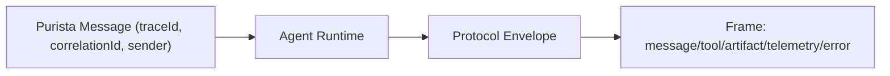

# AI Protocol

The PURISTA AI protocol is the structured payload format used by `@purista/ai` for agent outputs.

It is designed for three things:

1. **Internal consistency** across command/stream/queue/HTTP flows.
2. **Traceability** for nested tool and agent chains.
3. **Interoperability** with external ecosystems (for example Agent-to-Agent and MCP) via adapters.

## Design principles

- Agent internals remain a black box (no protocol field can force tool execution decisions).
- Protocol rides on top of standard PURISTA message transport.
- Correlation and identity come from PURISTA metadata and are preserved in envelopes.
- Consumers should usually parse and render envelopes, not construct them manually.

## Envelope model

Each emitted envelope contains metadata plus one frame.



Core envelope fields:

- `version`
- `messageId`
- `conversationId`
- `inReplyTo`
- `timestamp`
- `actor` (`service`, `version`, optional `agent`, optional `instanceId`)
- `userId` / `tenantId` (when available)
- `frame`

## Frame kinds

| Kind | Purpose | Typical consumer action |
| --- | --- | --- |
| `message` | Partial/final text output | render assistant text |
| `tool` | Tool lifecycle (`invoked/success/error`) | show timeline/tool panels |
| `artifact` | Structured output chunks | render JSON/file widgets |
| `telemetry` | usage + duration + provider + pool | capture metrics/observability |
| `error` | handled/unhandled error data | show failure UI + diagnostics |

## How handlers emit protocol safely

Most agent handlers should use `context.stream` helpers:

```ts
context.stream.sendChunk('Thinking...')
context.stream.sendFinal(answer)
context.stream.sendArtifact({ artifactId: 'citations', content: { ids: ['doc-1'] }, final: true })
```

Tool invocation should go through allowlisted helper calls:

```ts
const ticket = await context.tools.invoke('support.1.createTicket', { title: 'Refund request' })
```

The runtime automatically emits tool frames and telemetry.

## Frontend consumer reference flow

A lightweight consumer loop is:

1. receive SSE chunks
2. parse each chunk as `agentProtocolEnvelopeSchema[]`
3. route by `frame.kind`
4. render timeline grouped by `conversationId` + `inReplyTo`

```ts
import { agentProtocolEnvelopeSchema } from '@purista/ai'

const envelopes = agentProtocolEnvelopeSchema.array().parse(parsedChunk)
for (const envelope of envelopes) {
  switch (envelope.frame.kind) {
    case 'message':
      // append text
      break
    case 'tool':
      // show tool activity
      break
    case 'telemetry':
      // update token/duration widgets
      break
    case 'error':
      // show failure state
      break
  }
}
```

## Reference interoperability helpers

`@purista/ai` exports reference adapters in `@purista/ai/protocol`:

- `toAgent2AgentReferenceMessage(...)`
- `fromAgent2AgentReferenceMessage(...)`
- `toMcpReferenceToolResult(...)`
- `fromMcpReferenceToolCall(...)`

These are intentionally named **reference** adapters: they help bridge protocols but are not a full implementation of official external specs.

You can find a copy-pasteable reference consumer implementation in:

- `/Users/sebastianwessel/projekte/@purista/purista/examples/ai-basic/src/client/protocolConsumer.ts`

### Agent-to-Agent reference example

```ts
import { toAgent2AgentReferenceMessage } from '@purista/ai'

const referenceMessage = toAgent2AgentReferenceMessage(envelope)
// send to external bridge/router
```

### MCP reference example

```ts
import { toMcpReferenceToolResult } from '@purista/ai'

const mcpResult = toMcpReferenceToolResult(envelopes)
// return from MCP tool handler
```

## Practical companion page

For HTTP/SSE usage and stream transformation utilities, continue with [Protocol & Streaming](./protocol-and-streaming.md).
