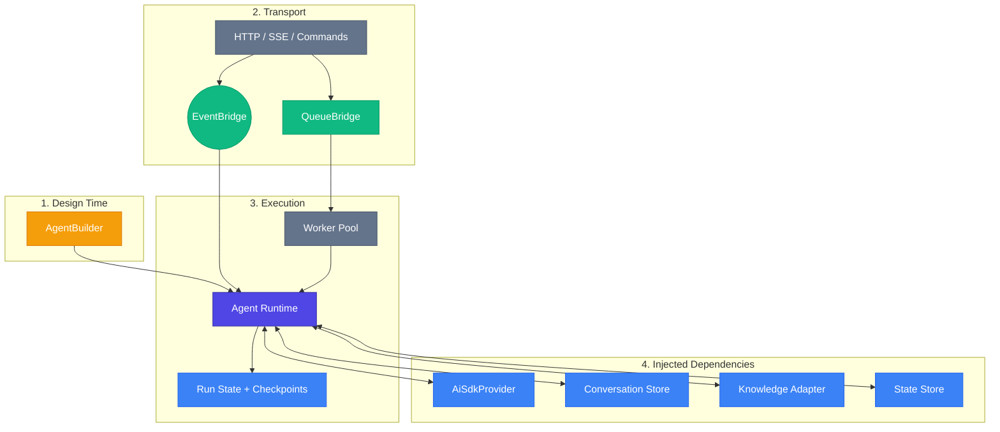

# AI agents

`@purista/ai` integrates agents as first-class citizens into the PURISTA ecosystem. Agents share the same EventBridge, observability, security, queue, and store concepts as the rest of PURISTA.

Agents can run in two modes:

- **Inline** for short, fast interactions such as classification or a single response turn.
- **Queued durable** for long-running work that should survive restarts, expose live progress, and resume from checkpoints.

The transport is separate from the execution model. You can expose either mode over HTTP, SSE, commands, or sub-agent calls. A queued durable agent still looks like a normal HTTP endpoint from the outside, but internally it runs through a queue-backed worker pool.

## System Map

## Conceptual Mapping

- **AgentBuilder**: defines what the agent is, what it can call, and how it executes.
- **AgentInstance**: binds the definition to providers, stores, and queue bridges.
- **Queued durable run**: durable execution state plus queue ownership plus checkpoints.
- **Conversation memory**: LLM context for chat history.
- **Run state**: operational workflow state, progress, and recovery.

## Pattern Cheat Sheet

| Mode | Best for | Notes |
| :--- | :--- | :--- |
| **Inline agent** | Fast classification, simple routing, short answers | Executes directly in the current request/turn. |
| **Queued durable agent** | Architecture synthesis, simulation, planning, validation | Needs `queueBridge`, run-state, and checkpoints. HTTP typically uses attach-and-stream. |
| **A2A / nested invocation** | Parent/child orchestration | Use `forward(...)` when the child should be visible to the user. |

## Learning Path

1. **[Quick Start](./getting-started.md)** — Build one inline agent and one queued durable agent.
2. **[Builder](./agent-builder.md)** — Define capabilities, execution mode, and HTTP exposure.
3. **[Context](./handler-context.md)** — Use tools, models, orchestration, and durable run state.
4. **[Durable Run State](./run-state.md)** — Plans, tasks, checkpoints, locks, and recovery.
5. **[Runtime](./runtime.md)** — Inject providers, queue bridges, and concurrency limits.
6. **[Invocation](./invocation.md)** — Call agents from commands, services, and scripts.
7. **[Web & SDK](./frontend.md)** — Attach durable progress to a React UI.
8. **[Memory & Knowledge](./memory-and-knowledge.md)** — Keep chat memory separate from workflow state.
9. **[Testing](./testing.md)** — Test inline and queued agents deterministically.

For deeper queue bridge, store, or protocol details, see the advanced handbook.
