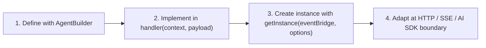

# AI agents

`@purista/ai` should be understood in the same way as the rest of PURISTA:

1. define the workload with a builder
2. implement the business logic in the handler
3. create an instance with real runtime dependencies
4. adapt only at the transport or SDK boundary

This handbook section is organized around that exact flow.

## The Mental Model

- `AgentBuilder` defines what the agent is allowed to do.
- The handler uses `context` to call models, commands, child agents, stores, skills, and streaming.
- `getInstance(...)` binds the definition to real models, stores, queues, skills, and sandbox execution.
- Adapters such as the Vercel AI SDK integration sit at the edge. They do not own your business logic.

If you keep those boundaries clean, the API becomes much easier to understand.

## The Canonical Flow

The most important rule is: do not jump straight into SDK adapters or sandbox details before the first three steps are clear.

## One Running Example

Across the pages below, the same example is used repeatedly:

- a queued durable `supportAgent`
- one inline `triageAgent`
- one allowlisted command `support.1.lookupFaq`
- two declared skills:
  - `spec-elicitation`
  - `support-workflow`

That example is intentionally small, but it exercises the main PURISTA concerns:

- builder declaration
- handler logic
- typed instance creation
- skills
- streaming
- queued durable execution
- model-provider adapter usage

## What Each Page Answers

### 1. Define

- [Quick Start](./getting-started.md)
  Builds one complete working agent path end to end.
- [Builder](./agent-builder.md)
  Explains what belongs in `AgentBuilder` and what does not.
- [Skills](./skills.md)
  Shows how to define skills and declare them in the builder.

### 2. Implement

- [Context](./handler-context.md)
  Explains what the handler gets and how to use it.
- [Durable Run State](./run-state.md)
  Focuses on plans, tasks, checkpoints, locks, and recovery.
- [Invocation](./invocation.md)
  Covers child-agent orchestration and agent-to-agent calls.

### 3. Create The Instance

- [Runtime](./runtime.md)
  Shows what belongs in `getInstance(...)`: models, skills, stores, queue bridges, pools, and sandbox runtime.
- [Memory & Retrieval](./memory-and-retrieval.md)
  Clarifies conversation memory, retrieval, and durable run state boundaries.

### 4. Adapt

- [AI SDK Adapter](./ai-sdk-adapter.md)
  Explains how to adapt PURISTA bindings and skills to the Vercel AI SDK.
- [External Runtime Bindings](./external-runtime-bridge.md)
  Describes the provider-neutral binding layer.
- [Web & SDK](./frontend.md)
  Covers HTTP/SSE transport and frontend streaming.
- [Sandbox Runtime](../../3_eco_system/sandbox.md)
  Covers isolated repo and skill execution when the agent needs a real workspace.

## Decision Rules

- Start with [Quick Start](./getting-started.md) if you want a full working path.
- Start with [Builder](./agent-builder.md) if you are designing the contract of an agent.
- Start with [Context](./handler-context.md) if you already have a builder and need to implement behavior.
- Start with [Runtime](./runtime.md) if the main question is how to bootstrap the agent in production.
- Start with [AI SDK Adapter](./ai-sdk-adapter.md) only when the model/tool loop will run through Vercel AI SDK.

## Common Mistakes

- Treating agents as “just prompts” instead of normal PURISTA workloads with explicit dependencies.
- Mixing builder-time declaration with runtime provisioning.
- Loading tools or skills implicitly instead of declaring them and providing them at `getInstance(...)`.
- Starting with SDK adapters before the core PURISTA flow is implemented.

## What To Read Next

If you want one coherent walkthrough, read in this order:

1. [Quick Start](./getting-started.md)
2. [Builder](./agent-builder.md)
3. [Context](./handler-context.md)
4. [Runtime](./runtime.md)
5. [Skills](./skills.md)
6. [AI SDK Adapter](./ai-sdk-adapter.md)
