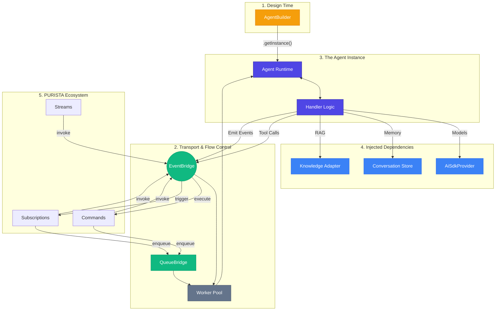

# AI Agents

`@purista/ai` integrates agents as first-class citizens into the PURISTA ecosystem. They share the same EventBridge, observability, and security models as your services, allowing for a unified architecture.

## System Map

The following map illustrates how the **Builder** defines the agent, how the **Runtime** executes it, and how it interacts with **Stores** and the **Ecosystem**.

## Conceptual Mapping

- **AgentBuilder**: Your **Blueprint**. It defines "what" an agent is.
- **AgentInstance**: Your **Worker**. The runtime object that handles requests.
- **Worker Pools**: Your **Brakes**. They prevent resource exhaustion and rate limit hits.
- **Memory & RAG**: Your **Context**. Conversation Stores handle short-term history; Knowledge Adapters handle long-term domain data.

---

## Pattern Cheat-Sheet

| Feature | Primary Purpose | Best For... |
| :--- | :--- | :--- |
| **Streaming (SSE)** | Instant Feedback | User-facing chat interfaces. |
| **Async Queues** | Resilience | Background analysis of large documents. |
| **Event-Driven** | Decoupling | Automated auditing, triage, or classification. |
| **A2A (Agent-to-Agent)** | Specialization | Complex workflows where one agent delegates to another. |

---

## Learning path

1.  **[Quick Start](./getting-started.md)** — CLI scaffolding and your first "Hello World" agent.
2.  **[Builder](./agent-builder.md)** — Defining tools, memory, and capabilities.
3.  **[Context](./handler-context.md)** — Exploring the `context` toolbox.
4.  **[Runtime](./runtime.md)** — Managing instances and concurrency.
5.  **[Invocation](./invocation.md)** — Calling agents from commands or scripts.
6.  **[Web & SDK](./frontend.md)** — Connecting your agent to a modern UI.
7.  **[Memory & Knowledge](./memory-and-knowledge.md)** — Managing history and RAG.
8.  **[Testing](./testing.md)** — Ensuring reliability with deterministic tests.

For deep dives into Custom Stores, MCP/A2A, or protocol internals, see the **[Advanced Section](../advanced/index.md)**.
