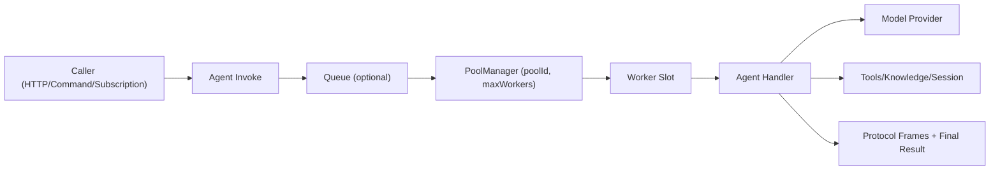
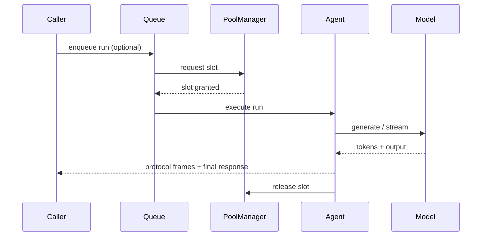
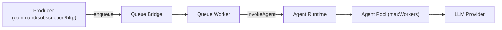

# Run & Invoke Agents

An agent build result is inert until runtime dependencies are bound via `getInstance(...)`.

This page focuses on four runtime concerns:

1. definition vs runtime instance
2. bootstrap and start/stop
3. invocation patterns (context + standalone)
4. async queue execution and worker concurrency

## Definition vs runtime instance

An `AgentBuilder` result (`supportAgent`) is a definition only: schema contract, handler logic, allowed tools, and endpoint metadata.

`getInstance(eventBridge, options)` is where runtime wiring happens:

- concrete model provider instances
- concrete session/knowledge adapters
- logger/tracer integration
- runtime pool size (`poolConfig`)

This separation keeps business logic stable and moves deployment/runtime settings to startup code.

## Bootstrap the instance

```ts title="src/index.ts"
import { DefaultEventBridge } from '@purista/core'
import { AiSdkProvider } from '@purista/ai'
import { createOpenAI } from '@ai-sdk/openai'
import { supportAgent } from './agents/supportAgent/v1/supportAgent.js'

const eventBridge = new DefaultEventBridge()
await eventBridge.start()

const openai = createOpenAI({ apiKey: process.env.OPENAI_API_KEY! })
const provider = new AiSdkProvider({
  model: openai('gpt-5.2-mini'),
  systemPrompt: 'You are a friendly support engineer.',
  defaults: { temperature: 0.2 },
})

const supportAgentInstance = await supportAgent.getInstance(eventBridge, {
  models: {
    'openai:gpt-5.2-mini': provider,
  },
  sessionStore: aiConversationStore,
  knowledgeAdapters: {
    supportFaq: faqKnowledgeAdapter,
  },
  logger,
  tracer,
  poolConfig: {
    poolId: 'support',
    maxWorkers: 4,
  },
})

await supportAgentInstance.start()
```

- `eventBridge` is mandatory; every agent registers an internal service (`<agentName>.run`).
- `models` must satisfy aliases declared via `.defineModel(...)` in the agent builder.
- `sessionStore`/`knowledgeAdapters` define what `context.conversation`, `context.session`, and `context.knowledge` access in the handler.
- When not provided, session stores, knowledge adapters, and pool managers default to in-memory implementations.
- If the agent definition declares knowledge aliases via `.useKnowledgeAdapter(...)`, TypeScript requires `knowledgeAdapters` in `getInstance(...)`.

## How runtime injection maps to handler access

```ts
// definition
export const supportAgent = new AgentBuilder({ agentName: 'supportAgent', agentVersion: '1' })
  .defineModel('openai:gpt-5.2-mini')
  .useKnowledgeAdapter('supportFaq')
  .setHandler(async (context, payload) => {
    // from getInstance(..., { models })
    const model = context.models['openai:gpt-5.2-mini']
    // from getInstance(..., { knowledgeAdapters: { supportFaq: ... } })
    const docs = await context.knowledge.supportFaq.query(payload.prompt, { limit: 3 })
    // from getInstance(..., { sessionStore })
    await context.conversation.addUser(payload.prompt)
    return { message: `${docs.length} docs` }
  })
  .build()
```

Definition decides aliases/capabilities; instance injection provides concrete implementations behind those aliases.
Knowledge operations automatically receive scope metadata (`tenantId`, `principalId`, `agentName`, `agentVersion`, `sessionId`) from the current message/session context.

## Runtime options reference

`getInstance(eventBridge, options)` supports:

| Option | Purpose | Typical choice | Notes |
| --- | --- | --- | --- |
| `models` | bind model aliases to provider instances | required in real workloads | fail-fast when a declared alias is missing |
| `poolConfig.poolId` | select execution pool namespace | explicit per workload class | defaults to `agent:<agentName>` |
| `poolConfig.maxWorkers` | cap parallel runs in-process | `1` locally, tuned in prod | runtime/deploy setting, not hardcoded |
| `sessionStore` | persistence backend for conversation/session state | in-memory locally, Redis/DB in prod | `context.conversation` uses this backend |
| `knowledgeAdapters` | RAG/document adapters by alias | in-memory or vector-store-backed | must match aliases used by builder |
| `logger`, `tracer`, `spanProcessor` | observability integration | inherit app defaults | keeps agent telemetry aligned with services |
| `config`, `resources` | custom app-specific dependencies | optional | use sparingly to keep handlers focused |

## Runtime pool config (important)

Pool identity and parallelism are runtime/deploy settings:

```ts
const supportAgentInstance = await supportAgent.getInstance(eventBridge, {
  models: { 'openai:gpt-5.2-mini': provider },
  poolConfig: {
    poolId: 'support', // optional; defaults to agent:<agentName>
    maxWorkers: 4,     // default is 1
  },
})
```

`maxWorkers` controls how many agent runs can execute in parallel for that agent instance.

- default is `1` (safe baseline)
- keep this low in local/dev
- tune this in deployment config for production
- use separate pools when different agent workloads need isolation

Operational rule of thumb:

- queue controls how much work is waiting
- `maxWorkers` controls how much work runs now
- provider/API rate limits still apply downstream

### Queue, pool, worker flow





## Invoke an agent programmatically

### 1. Integrated Service Pattern (Recommended)

When working inside Commands, Subscriptions, or Streams, use the `.canInvokeAgent` builder method. This integrates the agent into the functional context with full type safety.

```ts
const supportInvokePayloadSchema = z.object({
  message: z.string().min(1),
})
const supportInvokeParameterSchema = z.object({
  channel: z.enum(['command', 'queue']),
  locale: z.string().optional(),
})

export const notifyCommand = supportServiceBuilder
  .getCommandBuilder('notifySupportAgent', 'Runs the support agent from a command')
  .canInvokeAgent('supportAgent', '1', {
    payloadSchema: supportInvokePayloadSchema,
    parameterSchema: supportInvokeParameterSchema,
  })
  .addPayloadSchema(supportInputSchema)
  .setCommandFunction(async function (context, payload) {
    // 1. Get the final result
    const result = await context.invokeAgent.supportAgent['1']
      .call({ message: payload.prompt }, { channel: 'command' })
      .final()

    // 2. Or stream frames manually
    const invocation = context.invokeAgent.supportAgent['1']
      .call({ message: payload.prompt }, { channel: 'command' })

    for await (const frame of invocation) {
      context.logger.info({ frame }, 'Agent frame received')
    }

    return result
  })
```

The `.call()` method returns an `AgentInvocation` object which is an `AsyncIterable` yielding protocol frames and has a `.final()` helper returning a `Promise` for the full result.

### What `.canInvokeAgent(...)` validates

`.canInvokeAgent(agentName, agentVersion, config?)` supports:

- `payloadSchema`: types + validates the first `.call(payload, parameter)` argument
- `parameterSchema`: types + validates the second `.call(payload, parameter)` argument

- `payload` is the agent input payload (primary business input)
- `parameter` is side-channel metadata (for example channel/locale/feature flags)

```ts
const invokeParameterSchema = z.object({
  channel: z.enum(['command', 'queue']),
  locale: z.string().optional(),
})

commandBuilder
  .canInvokeAgent('supportAgent', '1', {
    payloadSchema: z.object({ message: z.string() }),
    parameterSchema: invokeParameterSchema,
  })
  .setCommandFunction(async context => {
    return context.invokeAgent.supportAgent['1']
      .call(
        { message: 'Need help with refund' },
        { channel: 'command', locale: 'en-US' }, // validated against schema
      )
      .final()
  })
```

Legacy shorthand still works:

```ts
.canInvokeAgent('supportAgent', '1', invokeParameterSchema)
```

That only configures `parameterSchema`.

### Payload vs parameter (short rule)

Use this split consistently:

- `payload`: business input for the agent run (prompt/message, domain fields)
- `parameter`: invocation metadata controlled by caller (channel, locale, flags)

Without explicit `payloadSchema`, payload falls back to core `AgentProtocolPayload` shape (`message`, optional `history`, optional `attachments`, passthrough for extra fields). That means minimal calls still work:

```ts
await context.invokeAgent.supportAgent['1']
  .call({ message: payload.prompt }, { channel: 'command' })
  .final()
```

If you need stricter payload typing per agent, enforce it at the agent boundary with the agent payload schema (`.addPayloadSchema(...)`) and keep caller-side TypeScript helpers local to your app.

### 2. Standalone Invocation

The helper `invokeAgent` (from `@purista/ai`) mirrors `invokeCommand` but automatically validates the agent protocol envelopes. This is ideal for scripts, manual triggers, or controllers where you don't have a Purista context.

```ts
import { invokeAgent } from '@purista/ai'

const result = await invokeAgent({
  eventBridge,
  agentName: 'supportAgent',
  agentVersion: '1',
  payload: { prompt: 'How do I reset my password?' },
  sessionId: 'chat-123',
  parameter: { locale: 'en' },
})

for (const envelope of result) {
  console.log(envelope.frame.kind, envelope.frame)
}
```

Use the optional `stream` argument to attach a responder that processes frames as the agent emits them (ideal for WebSockets or web streams).
If `sessionId` is provided and payload is an object, `invokeAgent` injects it automatically when missing so implicit `context.conversation` / `context.session` resolution works without manual payload wiring.

### invokeAgent options reference

| Option | Purpose | Use case |
| --- | --- | --- |
| `agentName`, `agentVersion` | target agent | required for every invocation |
| `payload` | main input | same shape as agent payload schema |
| `parameter` | optional side-channel input | locale, channel, feature flags |
| `sessionId` | stable conversation identity | continue existing conversation across invocations |
| `principalId`, `tenantId` | identity/multi-tenant isolation | per-user or per-tenant memory partitioning |
| `correlationId` | trace correlation | linking runs to upstream workflows |
| `timeoutMs` | invoke timeout | fail faster for synchronous APIs |
| `stream` | receive frames incrementally | websockets/custom transports |

## HTTP exposure

`.exposeAsHttpEndpoint('POST', 'agents/supportAgent')` automatically adds an endpoint to your generated OpenAPI spec. The endpoint behaves like any streaming command:

```ts
export const supportAgent = new AgentBuilder({ ... })
  .exposeAsHttpEndpoint('POST', 'agents/supportAgent')
  .setHandler(...)
  .build()
```

SSE is the default streaming mode for exposed agent endpoints. Call `.setStreamingMode(...)` only when you need a non-default mode.

If your API gateway already maps `POST /api/v1/agents/supportAgent` to the bridge, clients can `fetch` it directly. For custom controllers, pipe the envelopes to SSE/chunked responses using the [Protocol & Streaming](./protocol-and-streaming.md) helpers.

For protocol semantics and a client-side parser loop, see [AI Protocol](./ai-protocol.md).

## Background & queues

For production workloads, queue-driven execution is usually the default pattern.



### Queue-driven pattern

1. expose a command/subscription/event path that enqueues work
2. queue worker invokes the agent
3. pool settings protect concurrency and upstream APIs

```ts
// inside a queue worker / background handler
const envelopes = await invokeAgent({
  eventBridge,
  agentName: 'supportAgent',
  agentVersion: '1',
  payload: { prompt: 'Summarize ticket #42' },
})
```

If you already use Purista queues, keep that setup.  
The AI package does not require a dedicated queue implementation.

### How queue settings and agent pool settings relate

- queue worker concurrency (`queue-worker` setup) controls how many jobs are leased/processed
- agent pool config (`poolConfig.maxWorkers`) controls how many agent runs execute in-process
- effective parallel LLM calls are bounded by the lower of these limits in each process

Use both knobs:

- queue knobs for delivery throughput and retry timing
- agent pool knobs for provider pressure and application-level backpressure

### Queue + pool sizing (must configure both)

Example target profile:

- queue worker concurrency: `10`
- agent pool `maxWorkers`: `4`

Result: up to 10 jobs may be leased from queue, but only 4 agent runs execute at once in this process.  
This protects provider APIs from bursty parallelism while still keeping the queue busy.

### Why this is the default operational mode

- caller does not block on long LLM execution
- retries/delivery semantics are handled by queue infrastructure
- worker parallelism and `poolConfig.maxWorkers` together control throughput
- easier cost/rate-limit control than unbounded sync invocations

### What runs where

- **Queue bridge** decides delivery/lease/retry mechanics
- **Agent pool** decides in-process parallel execution cap (`maxWorkers`)
- **Provider/LLM** executes model calls

Both queue worker concurrency and agent pool size matter. Set both intentionally.

### Bring your own queue setup

You can keep full control over queue bridge, retry, visibility timeout, and scheduling. The agent layer only needs an invocation call in your worker.

```ts
// command handler -> enqueue
await context.queue.publish.aiWorkloads({
  agentName: 'supportAgent',
  agentVersion: '1',
  payload: { prompt: 'Summarize ticket #42' },
})

// queue worker handler -> invoke
await invokeAgent({
  eventBridge: context.eventBridge,
  agentName: payload.agentName,
  agentVersion: payload.agentVersion,
  payload: payload.payload,
})
```

Use normal queue builder/worker options for transport-level behavior:

- [The Queue Builder](../queue/the-queue-builder.md)
- [The Queue Worker Builder](../queue/the-queue-worker-builder.md)
- [Async HTTP exposure](../queue/queue-http-exposure.md)

### Built-in runtime helpers

- `@purista/ai` ships reference services (`AIOrchestratorService`, `AIWorkerService`) that ingest manifests, enqueue runs, and execute them in isolated workers.
- Queue bridges (Redis, NATS, AMQP, …) treat agents like any other workload—define a queue worker that calls `invokeAgent` internally, then rely on the queue bridge for delayed or batched execution.
- Concurrency pools apply across sync and async invocations. Configure `poolConfig.maxWorkers` at runtime/deploy-time so each environment controls throughput independently.

### Failure behavior in queue mode

- transient failures are retried by your queue setup and/or agent retry policy
- handled errors emit protocol error frames and can still be inspected in worker logs
- telemetry frames include duration/token usage so operations can alert on degraded runs

Pick the approach that matches your deployment. Local development usually starts agents inside the same process; production often combines HTTP exposure for real-time calls plus queue workers for heavy background chains.
