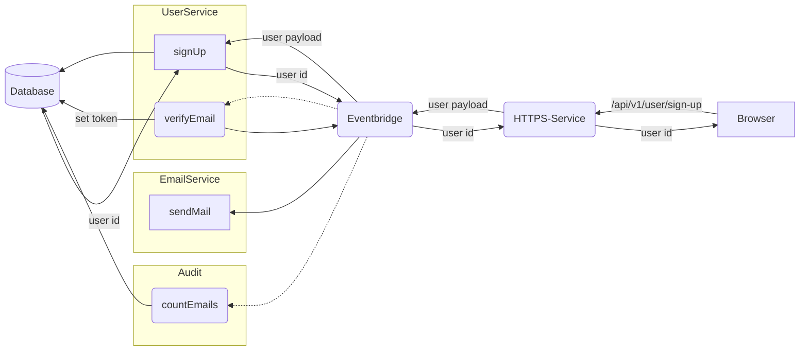

---
# This control sidebar index
index: true
order: 10
# This is the icon of the page
icon: brain fas
# This is the title of the article
title: Concept
# A page can have multiple tags
tag:
  - Installation
  - Setup
  - Guide
# this page is sticky in article list
sticky: true
# this page will appear in article channel in home page
star: true
---

# Concept

## Main idea

The concept behind PURISTA is quite simple and a message based approach.  
There are message senders and receivers. Messages are exchanged via an event bridge.  

The logic resists in Service. They are the DDD part.  
A service is a logical group of commands and subscriptions which are relating to a single domain.  

Commands are active, triggered by someone, and the caller expects some kind of result. This is similar to functions in any programming language. It means the caller knows about the existence of the called service & command, and he knows at least the input and output format and maybe something about possible error responses.
How the called command function is implemented or how it is working is unknown and not related to the caller.

Subscriptions are a passive part, like event listeners. A subscription is triggered as soon as a message matches the subscription criteria. The producer of this message does not have knowledge about this subscription.

Commands and subscription can call other commands from same or other service by sending command messages. This means, there is a clean, structured and unified internal interface, which is also observable and traceable with error handling out of the box.

This allows real complex setups and scenarios.

## Example

We will use a simple example for better understanding.

- the browser calls the endpoint `/api/v1/user-sign-up`
- the web server will send a command request `signUp` to service `User`
- the command `signUp` is responding to web server with the ID of this new created user
- the web server will respond to the browsers request
- the service `User` has a subscription `verifyEmail` which is listening to all successful calls to `signUp` command
- the subscription `verifyEmail` in service `User` is creating a verification token which is stored in user's domain, creates the email subject and body and is sending a command `sendEmail` to the service `Email`
- the `sendEmail` command in service `Email` connects to the mail provider and sends the email
- in service `Audit` we have also some subscription `countEmails` which is listening to all invocation responses of command `sendMail` from service `Email` which is counting success and failure.
...and so on

Each of these steps is only one single and simple function, which is easy to implement, to understand and to test.
Each of these steps has input-output-validation in place.
Each step has its own error handling and responses are divided into success and error response.
Each step is decoupled from the others.

In our example:
If creating the new user is failing, none of the other steps is started and the browser receives a proper error response.
If sending of verification email is failing, it does not affect the user creation, and it is traced by the `Audit` service.

If you might want to extend this, to send two-factor-pin via SMS, you simply need to add a new service `SMS` with a command `sendSms`.
Add a subscription `send2FA` in service `User`, which is listening to successful user creations, like the `verifyEmail` subscription does.  
Invoke `sendSms` in service `SMS` from subscription `send2FA` in service `User`.

We might need a new version of user sign up, because now, the input payload has a required field `phoneNumber` for our 2FA.
But we do not want to break any existing and working thing.

We simply copy the whole service `User` to a new service `User2`.  
For service `User2` we bump version to `2.0.0`.

All API endpoints for `User2` are now directly available as `api/v2/` and our new Service is also reachable by all other services.  
Now we can safely make our changes in `User2` and mark `api/v1/` as deprecated.  
As soon as we finished our changes, tested them and so on, we can completely switch to the new version and remove the old one.

## Seriously a new framework

You might ask yourself, why the hell there is a need for some other framework.  
Because there are more or less three kinds of frameworks out there.

### The old stars

The most mature ones, are focused on creating some kind of webserver.  
No matter if it is express.js, hapi, restify/fastify and all the other cool ones.  
There is a huge ecosystem around these frameworks.  
They are pretty cool and helpful creating webservers, but they don't help you to build the logic behind some endpoints.  
PURISTA does not try to replace them. PURISTA will bring the missing part for building the logic behind the endpoints and you should be able to combine them.

In fact, it works pretty well, to combine these frameworks with PURISTA.  
The provided package `@purista/httpserver` is using fastify under the hood.

### The unicorns

The next kind of frameworks are the unicorns - the specialists.  
They are focused on solving specific issues and requirements, and do not try to "fit for all usecases".  
Let's give a big 👏 to Feathers and Moleculer as cool examples for this category.  
Pretty sure there are some other awesome unicorns out there. Just let us know!  

Highly recommended to try them out, play around, do some cool stuff and maybe they perfectly fit for your next project.

### The philosophers

The third category are the philosophers.
They are focused on patterns, styles, conventions, abstractions, layers and wrappers.  
You end up with framework specific decorators, dependency injections and other (uncool) stuff like that.
Let's mention NestJs and Ts.ED at this point.  
They are the complete opposite of PURISTA and the antipattern of PURISTA's main idea.

### PURISTA

PURISTA tries to have no framework specific stuff as much as possible.  
It does not try to treat developers to use certain patterns, conventions or styles.  
It tries to separate, decouple things and to avoid having dependencies within your logic.

For example, with dependency injections, you have the need, that your dependency is instantiated within your current progess.  
This is a first warning sign for questions like "How to scale things up?" and "How to handle multiple instances" and "How to maintain".

You quickly end up with one dependency injection for database, one for websockets, one for logging, one for...  
...all they need to be available in your current process...  
At the end you've build one monolithic monster, which might become totally unpredictable and maintable.  
It is the scenario you should avoid: simple changes on one end and it possibly fails on some other end.

PURISTA tries to avoid and solve this issue by using a unified event bus and to adapt some of the domain driven development patterns. This means you are able to break this dependency chain, and you are able to use ressources which are available somehow, somewhere.  
This also increases stability, because if one part isn't working, the rest won't crash or stop working from technical perspective.  
PURISTA adapts the idea of microservices and serverless functions from that point of view.

As an example:

You might have some service function which receives a http request.  
You process the data, you persist the data and you send some message via websocket.

With dependency injections, you will need to have error handling within your function for processing the data, persisting the data and sending messages over websocket. And in case the persistency is unavailable or the websocket connection get's temporary lost - you do what?  
You can start adding more abstractions, layers and stuff to workaround, but does this really fix the underlaying problem and is it worth to have such code bloat from testing and maintaining perspective?

With the approach of PURISTA, you get the a validated input, you process the data, you persist somehow, and you send a message via websocket somehow.  
If, how and when does not matter for the input processing part.  
Each of the steps has verified in-/output and basic error handling out of the box.

Depending on the event bus you choose:  
You can build real robust and scalable system, because you can setup your system to be able to be fully asynchronous and recoverable.  
If the persistance part isn't available right now, the information can be hold within the event bus until the persistance part is available.  
You can build the system to send the message via websocket, no matter if the persistance part is done. Or you can decide to trigger the websocket part as soon as the persistance part is done. And again, you can decide what should happend, when the websocket connection is currently unavailable.

This is a huge benefit to control how to handle such cases, as you are now able to control if you like to loose business data.

You can scale out as you need, as there are maybe multiple instances running which are able to persist data or to send websocket messages.

### Focus on business logic

These 4 words are describing the intention and motivation behind PURISTA.

Focus on business logic, solve the clients issue, provide the features and just deliver!  

Just go through your own code and check what is your daily business?

You get some kind of input, you validate it, you compute something, request some data, maybe persist some data and you return some result or you trigger some other function.  
You will have some error handling and some logging.

How much setup, configuration, abstraction, layers do you really need and much code do you produce for even simple stuff?

### Decuple from infrastructure and architecture

One of the key features of PURISTA is the separation of business logic from architectural and/or infrastructure decisions.  
It's done by the concept of having services with functions and subscriptions which are communicating over some event bridge.

How they are orchestrated, deployed and where they are running does not matter.

You can decide if you want to deploy your logic as single monolith or in some microservice style or as serverless functions.  
There is no need to decide if you like to use your own server or to some cloud provider.  

### K.I.S.S.

Keep things as simple as possible and do not overcomplicate everything.  
Do not try to do some fancy stuff only _"Because I can"_.  
Do not try to write typescript in the style of other languages like JAVA. If you want to write Java code - it's fine - but then please use Java.

Do not loose yourself in patterns and abstractions and stuff like this.  
Object/class style fits best for your current needs? Use it!
Functional programming style makes more sense at some other point? Use it!
A abstraction at a specific code snipped makes sense? Do it!
Some layer might not be necessary or overkill? Remove it!

You got all the knowledge! Use it! Mix it up! Your code - you rules!  
Do not write hundreds of code lines, only because of "that is the correct way to follow the XXX pattern" or "it is the way you have to use the framework".

Don't write 100 lines if you can do it in 5 (only if you don't get payed per line of course).

### Low learning curve

Using PURISTA should be easy and joyfull.  
Even with beginner level knowledge it should be possible to build cool, stable and production ready stuff.  
There are lot's of "If you want or if you need, you can...".  
There are some "It is recommended, to ...".
But there are only a few "You must...".

Also there is a wild mix of adaptions from known things like microservices, domain driven development, functional programming, event patterns, messaging systems. So, anybody with some fundamental experiences, will get the "ah, I know this, it's like..." effect.  
No rocket science at all - but hopefully it rocks your next project 🚀.

### Predictable behavior

Predictable behavior is one of the fundamentals of PURISTA.  
As an example let's mention the integrated input/output validation here.  
In normal scenarios, every function input and result output is validated against a schema at runtime and has propper types out of the box during development.  
This means you already know there will be no technical incorrect input at any point, no unwanted output which might leak some data and you exactly know the error handling on invalid data.  
Also, any thrown error will be automatically catched, logged and transformed into a defined error(-response) shape.

Especially javascript/typescript is often blamed for it's error handling, but this also some opportunity.  
It is js/typescript - let it throw! PURISTA will handle the worst case for you!  
You don't need to implement error handling for any possible error which might occur.  
Handle only the errors you need to handle at business level and improve your code, architecture and infrastructure over time to avoid technical errors!
There is simply no need to have always some wrapped result, where you need to check, if it is a success or failure. And if it is a failure, what kind of failure and how to handle it and how to bubble up the error.

The usage of some unified exchange bus allows to highly configure what "happens when...". It allows to build setups which are able to replay things, recover states, execute "when available" and so on.

### Maintenance

Maintenance is very important to any project and highly impact costs and speed of future enhancements.  

PURISTA tries to lower the effort and costs for maintaining by splitting high complex scenarios into small, simple pieces in combination with defined interfaces and the ability to version services.

This offers opportunities, like having different versions in parallel, instead of dangerous "close eyes, press switch button and fingers crossed".

But more important:

Smaller pieces are easier to understand, easier to change, easier to test and you avoid the cascading "if I touch this, I need to touch everything"

### Security

To build secure and stable software is essential for success.

Using PURISTA does not mean you end up with a 100% bullet proof solution without any effort. But it reduces or prevents a lot of possible issues by design.  
Having a solid input/output validation on any single step, means an increase of overhead and also longer execution time. But it is worth to have it in place.  
You prevent the system by design to allow technical invalid input (implausible), you verify the technical correctness (plausible) on each step and you prevent your system to leak data accidentally.  
It also simplifies any audit, as you can go through each step of your system and you can proof "I verify that... and on error it will... it will not allow to...".

So, PURISTA does not even try to avoid security issues like low encryptions, multi-vector-high profile hacker attacks or similar. But it builds a solid basement for your software. Based on validation, unified interfaces, error handling, predictable behavior and strict separation.  
And a stable, solid and robust software, which only exposes needed information, means higher barrier for attackers and lower the risks for bugs.

### Traceability

Traceability comes in place at least when something does not work as expected.  

One kind of issues are the one which are the more technical ones. Some function is throwing some error.
In other software designs, you often end up with some code line number, and you start digging into the code, follow all the logic through a lot of files. You jump from one abstraction to the next one. You check wrapper by wrapper, interfaces and all that stuff.

The other kind of issues are even more hard to track. If the stuff is working from technical point of view, but not from business view. 
In this case you need to walk through the code logic, and check if the business logic is matching the implementation logic. And depending on your abstractions, layers and wrappers you will quickly blow up your head.

The concept of PURISTA will help you in both cases. You simply follow the message flow. Check the input/output of the functions and you will find the root cause quickly.  
You are able to follow single requests, because each one has a unique trace id all the way down. You can attach external providers and software solutions to track errors on each of your functions. You can track metrics on each of your functions.

### Scaling

PURISTA adapts the ideas from microservices and serverless functions to separate the logic into small pieces and to use some way of unified communication.
This means you can scale out things as you need.

The main difference is, that you do not need to decide at very first step, how you like to deploy or how you like to scale at the end.  
You can simply start local and scale when you need. You are not nailed down to start with infrastructure or architectural questions and setups.

Start small and efficient like you would do with the beginners "hello world" example and move to the solution which fits your needs.

You are not limited to scale "the whole blob". You are able to scale parts of your software differently.

As an example, you might have some function which takes longer for processing data. This means this function can't handle the same amount of requests, than the rest of your system. You are able to scale this specific part by adding more instances, without the need to have more instance for all of your functions.

### Testing

The core concept of PURISTA is helping you, when it comes to testing.  
Check out the handbook chapter [Testing](6_testing.md)