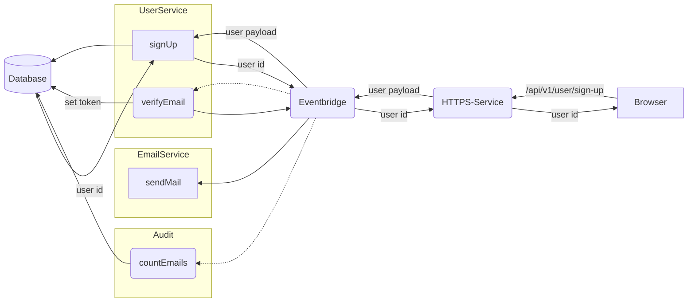

---
# This control sidebar index
index: 1
# This is the icon of the page
icon: brain fas
# This is the title of the article
title: Concept
# A page can have multiple tags
tag:
  - Installation
  - Setup
  - Guide
# this page is sticky in article list
sticky: true
# this page will appear in article channel in home page
star: true
---

# Concept

## Issues to solve

### K.I.S.S.

Keep things as simple as possible and do not overcomplacate everything.  
Do not try to do some fancy stuff only _"Because I can"_.  
Do not try to write typescript in style of other languages like JAVA. If you want to write Java code - it's fine - but than please use Java.

### Predictable behavior

### Maintainance

### Security

### Traceability

### Scaling

### Testing

## Framework comparison

There are quite a lot of frameworks out there, so we we would need a new one?  

Basically most of them are focused on building http servers which provide content and api's.  
PURISTA keeps focus on building and structuring the logic behind http endpoints.  
Http endpoints are kind of "simply falling out".  

In fact, the http server itself is only one single plugged in service and not the core of framework.

A comparison is always a kind of personal opinion, but in general it highly depends on your usecase, which framework should be used.

### Express

Express is one of the big players with great ecosystem, big community and mature code base.  
It's focused on providing content, server side rendering and similar stuff.

So it is the to go solution if you've some CMS-like application.  

Pro:

- big ecosystem
- big community
- many documentation and ressources

Cons:

- call-back approach
- still not http/2 based
- project will quickly get a lot of package dependencies
- not build in typescript

### Restify/Fastify

Both focused on building REST-api's and the request-handler approach is quite simple to understand.  
It's the simple solution if you more or less simply provide REST endpoints for putting stuff into db and fetching stuff from db.

Pro:

- fast
- ready-to-go modules/plugins

Cons:

- typescript support

### NestJs/Ts.ED

Yeah - glitter and cookies!

A _"framework which solves all your problems"_, by putting a lot of own patterns, decorators on top of existing modules like express to build some Java-like environment with dependency injections and design patterns.  

Sorry, it's like these _"You get this awesome ready to go theme for 99 bugs"_, which is based on some open source theme and only some colors and images are quickly changed.  

It's for these kind of developers and consultants:

_"I know Java a bit from University - Let's use node.js & typescript because it's ung vogue and cool buzz word!_  
_We will save money and we will have more delivery!"_

...while trying to use patterns and styles from other languages and get payed per code line count.

There is no single reason to go for it and it does not solve any issue.

Again: If you want to develop like you would do in Java, than please use Java with it's great ecosystem and community!  
There are plenty reasons to use Java and it's patterns. Also Java has some skills which outperform javascript in many ways (stream handling, multitasking...).

### Feathers

Kind of unicorn which addresses specific usecase scenarios especially in webapp/mobile development.  
It is one of the most innovativ frameworks recently build for node.js/typescript.

One of the to-go-solution if you need a backend for webapps.

PURISTA itself is highly inspired by feathers.

Pros:

- typescript based
- solves specific scenarios
- low learnign curve
- live updates via websocket

Cons:

- flexibility on endpoints other than CRUD (v<5)

## Main idea

The concept behind PURISTA is quite simple and a message based approach.  
There are message senders and receivers. Messages are exchanged via an eventbridge.  

The logic resists in Service. They are the DDD part.  
A service is a logical group of commands and subscriptions which are relating to a single domain.  

Commands are active triggered by someone and the caller expects some kind of result. This is similar to a functions in any programming language. It means the caller knows about the existence of the called service & command and he knows at least the input and output format and maybe something about possible error responses.
How the called command function is implemented or how it is working is unknown and not related for the caller.

Subscriptions are a passive part like event listeners. A subscription is triggered as soon as a messages matches the subscription criteria. The producer of this message does not have knowledge about this subscription.

Commands and subscription can call other commands from same or other service by sending command messages. This means, there is a clean, structured and unified internal interface, which is also observable and traceable with error handling out of the box.

This allows real complex setups and scenarios.

## Example

We will use a simple example for better understanding.

- the browser calls the endpoint `/api/v1/user-sign-up`
- the webserver will send a command request `signUp` to service `User`
- the command `signUp` is responding to webserver with the id of this new created user
- the webserver will respond to the browsers request
- the service `User` has a subscription `verifyEmail` which is listening to all successfull calls to `signUp` command
- the subscription `verifyEmail` in service `User` is creating a verification token which is stored in users domain, creates the email subject and body and is sending a command `sendEmail` to the service `Email`
- the `sendEmail` command in service `Email` connects to the mail provider and sends the email
- in service `Audit` we have also some subscription `countEmails` which is listening to all invocation responses of command `sendMail` from service `Email` which is counting success and failure.
...and so on

Each of this steps is only one single and simple function, which is easy to implement, to understand and to test.
Each of this steps has input-output-validation in place.
Each step has it's own error handling and responses are divided into success and error response.
Each step is decoupled from the others.

In our example:
If creating the new user is failing, none of the other steps is started and the browser receives a propper error response.
If sending of verification email is failing, it does not effect the user creation and it is traced by the `Audit` service.

If you might want to extend this, to send two-factor-pin via sms, you simply need to add a new service `SMS` with a command `sendSms`.
Add a subscription `send2FA` in service `User`, which is listening to successfull user creations like the `verifyEmail` subscription does.  
Invoke `sendSms` in service `SMS` from subscription `send2FA` in service `User`.

We might need a new version of user sign up, because now, the input payload has a required field `phoneNumber` for our 2FA.
But we do not want to break any existing and working thing.

We simply copy the whole service `User` to a new service `User2`.  
For service `User2` we bump version to `2.0.0`.

All api endpoints for `User2` are now directly available as `api/v2/` and our new Service is also reachable by all other services.  
Now we can safely make our changes in `User2` and mark `api/v1/` as deprecated.  
As soon as we finished our changes, tested them and so on, we can completely switch to the new version and remove the old one.

