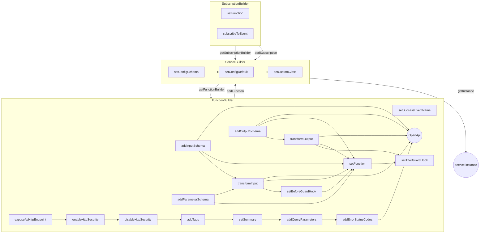

---
# This control sidebar index
index: true
order: 130
# This is the icon of the page
icon: wrench fas
# This is the title of the article
title: Builder
# A page can have multiple tags
tag:
  - Guide
# this page is sticky in article list
sticky: true
# this page will appear in article channel in home page
star: true
---

# Builder

PURISTA has the concept of builders to define services, functions and subscriptions. But why is this needed?

There is a need to define services, attach functions and subscriptions. And each function or subscription has also propperties, configurations, options and so on.

One simple option would be, to have some code generators. This is a solid concept, and very often used in frameworks. But it has some disadvantages. You get some bootstrap code, and align, extend, and change the generated code. You will also need some more or less fixed folder structure, which reduces the freedom of developers.  

While code generation in general is a great tools, they are not the best choice for our needs here.  
PURISTA tries to be decoupled from the underlaying system and infrastructure. So, we might need a way to convert our settings into a specific architecture, for a specific infrastructure or cloud provider. This conversion might be on the fly. So we will need to access and interpret the setup programmatically. Also, we want to avoid manual configurations and manual steps as much as possible. They are time consuming and error prone.

## Cascading

There are several parts, where one setting or configuration is impacting a whole service. For example, the custom configuration for a service might change. You propably don't want to change several functions and subscriptions, only because you add a simple property.

Types are dynamically set and generated. You can take the input for a function as an example. You have set the input schema, which generates the input typescript type for your function. It also sets the type of message payload and maybe generates the OpenApi definition.

Now, if you add a input payload transform hook, the type of message payload and the OpenApi defintion will change. The hook function itself will also have some input/output types.

There is a whole bunch of type definition stuff behind the scene, to ensure correct types, correct input and outputs. This improves speed during development, reduces the costs for maintaining code, and prevents bugs.

To get an idea, take a look at this diagram. This is a kind of typescript-type dependency graph. This is the stuff you would need to manage within your code and your brain, without builders.




## ServiceBuilder

As first step, we will need to setup a service. This can be done by using the service builder.  

```typescript
import { ServiceBuilder, ServiceInfoType } from '@purista/core'

export const myServiceInfo: ServiceInfoType = {
  serviceName: 'MyService',
  serviceVersion: '1',
  serviceDescription: 'my service',
}

export const UserServiceBuilder = new ServiceBuilder(myServiceInfo)
```

You might need some general service configuration, which is accessable within the service functions and subscriptions.  
You can quickly setup a schema validated configuration like this:

```typescript
import { ServiceBuilder, ServiceInfoType } from '@purista/core'
import { z } from 'zod'

export const myServiceInfo: ServiceInfoType = {
  serviceName: 'MyService',
  serviceVersion: '1',
  serviceDescription: 'my service',
}

const myConfiguration = z.object({
  requiredOption: z.string(),
  optionalOption: z.number().optional(),
  optionalWithDefaultOption: z.number().default(8080),
})

export const myServiceBuilder = new ServiceBuilder(myServiceInfo).setConfigSchema(myConfiguration)
```

You are now able to use a custom configuration, which is accessable within the service functions and subscriptions with `this.config`.  
The types are automatically generated and available in functions and subscriptions.  
You can set a configuration, when you create a new instance of your service.

```typescript
const customConfig = {
  requiredOption: 'set to value'
}

const myService = myServiceBuilder.getInstance(baseLogger, eventBridge, customConfig)

```

As you can see, the types are kind of intelligent. The type of setting the configuration during instance creation, differs from the configuration type which is available within your functions and subscriptions.  
By using a schema validation, your service will fail on instance creation, if the configuration is invalid. The error will be automatically logged.

There is also the option to set a default configuration. The default configuration will be merged with the provided costum configuration.

```typescript
export const myServiceBuilder = new ServiceBuilder(myServiceInfo).setConfigSchema(myConfiguration)
  .setDefaultConfig({
    requiredOption: 'req',
    optionalOption: 'default if nothing is set',
    optionalWithDefaultOption: 9090,
  })
```

You can also use your own service class implementation. This might be usefull in some use cases.

```typescript
import { ServiceBuilder, ServiceInfoType } from '@purista/core'
import { z } from 'zod'

export const myServiceInfo: ServiceInfoType = {
  serviceName: 'MyService',
  serviceVersion: '1',
  serviceDescription: 'my service',
}

const myConfiguration = z.object({
  requiredOption: z.string(),
  optionalOption: z.number().optional(),
  optionalWithDefaultOption: z.number().default(8080),
})

type ServiceConfigType = z.output<typeof myConfiguration>

class CustomClass extends Service<ServiceConfigType> {
  myClassMethod(){
    console.log('automatically available:', this.config.requiredOption)
    // ...do something here
  }
}

export const myServiceBuilder = new ServiceBuilder(myServiceInfo).setConfigSchema(myConfiguration)
  .setCustomClass(CustomClass)
```

As every function and subscription is running within the class context, the method `myClassMethod` will automatically be available by using `this.myClassMethod`

## FunctionBuilder

For adding a function to a service, you should use the function builder. It is recommended to use the `getFunctionBuilder` method of your service builder instance.

```typescript
const myFunctionBuilder = myServiceBuilder.getFunctionBuilder('functionName','some function description','functionEventEmitted')
```

## SubscriptionBuilder
