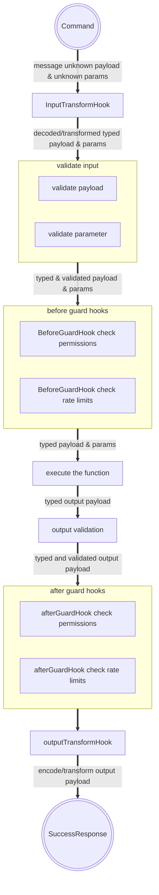

Hooks are a powerful way to separate technical needs from business logic.  
There are two different types of hooks:

There are hooks with return value, which are able to take inputs, execute some logic and return a value.  
The returned value is then used as input for the next hook or the business function.  
These hooks are expected to not throw any error and called transform hooks.

On the other hand, there are hooks which do not return a value. The purpose is to only validate input data, and they are expected to throw HandledError.  
For better differentiation, hooks without return values called guard hooks.

## Service function hooks

**Example-flow:**



### TransformInputHook

This transform hook is called before input validation.  
It allows implementing migrations, decoding or transformation of input message payload and message parameters without touching the main business logic.

A use case could be, that the message payload is encrypted and needs to be decrypted.  
Typically, anything like input schema migrations is also a good example for using transform hooks.

The input types of an input transform hook (payload & parameter) will be automatically set the types for original message payload and parameter.  
If you've set an input validation schema (you should do it always), the result type for the transform input hook is automatically set.

```typescript
import { FunctionDefinitionBuilder } from '@purista/core'
import { createDecipheriv } from 'crypto'
import { z } from 'zod'

import { UserService } from '../../UserService'
import { inputParameterSchema, inputPayloadSchema, outputPayloadSchema } from './schema'
import { signUp } from './signUp'


const payloadSchema = z.object({
  iv: z.string(),
  content: z.string()
})

const parameterSchema = z.object({
  algorithm: z.string(),
  secretKey: string.string()
})

export default new FunctionDefinitionBuilder<UserService>('signUp', 'Sign up a new unknown user', 'NewUserCreated')
  .addInputSchema(inputPayloadSchema)
  .addParameterSchema(inputParameterSchema)
  .addOutputSchema(outputPayloadSchema)
  .exposeAsHttpEndpoint('POST', '/sign-up')
  .transformInput(payloadSchema, parameterSchema, async function(_context, payload, params) {
    
    // _originalMessage.command.payload type will become automatically { iv: string; content: string }
    // _originalMessage.command.params type will become automatically { algorithm: string; secretKey: string }
    // the result type of this function is automatically set, because we set input and parameter schema before

    const decipher = createDecipheriv(params.algorithm, params.secretKey, Buffer.from(payload.iv, 'hex'))
    const decrpyted = Buffer.concat([decipher.update(Buffer.from(payload.content, 'hex')), decipher.final()])

    return {
      params,
      payload: JSON.parse(decrpyted.toString()),
    }
  })
  .setFunction(signUp)

```

### BeforeGuardHook

The before guard hook is extremely useful for any use case where you need to validate authorization/authentication, rate limits and similar things.

This guard should throw a HandledError, if for example the user is not allowed to execute this function.

```typescript
import { FunctionDefinitionBuilder, HandledError, StatusCode } from '@purista/core'

import { UserService } from '../../UserService'
import {
  inputParameterSchema,
  inputPayloadSchema,
  outputPayloadSchema,
} from './schema'
import { signUp } from './signUp'

export default new FunctionDefinitionBuilder<UserService>('signUp', 'Sign up a new unknown user', 'NewUserCreated')
  .addInputSchema(inputPayloadSchema)
  .addParameterSchema(inputParameterSchema)
  .addOutputSchema(outputPayloadSchema)
  .exposeAsHttpEndpoint('POST', '/sign-up')
  .setBeforeGuardHook(async function({ logger }, payload, params) {
    if(params.email === 'blocked@example.com') {
      logger.error('user not allowed')
      throw new HandledError(StatusCode.Forbidden)
    }
  })
  .setFunction(signUp)
```

### AfterGuardHook

This guard hook is called after response validation and before AfterTransformHook.  

There are not so much real use cases where it would make sense to use this hook.  
Example is additional logging and any kind of metrics.

It is also possible to use this hook for optimization purpose.  
As an example:

A function is making a financial transaction and returns the actual balance. You like to inform the user as soon as the balance is below a certain level.  
You could build a subscription which is listening for all responses of this function. Expecting that only 10% of function responses will result in informing the user, 90% of subscription invocations would waste resources.

<Badge text="Be aware" type="warning"/>

All hooks will need computation resources and because of this it will increase response time.  
Also keep in mind that, in case a hook fails, and it is throwing, the business information might be lost or can't be reproduced.

In the financial example, prefer a subscription or simply emit some custom event in the after guard hook instead of doing some time-consuming stuff.

```typescript
import { FunctionDefinitionBuilder } from '@purista/core'

import { UserService } from '../../UserService'
import { inputParameterSchema, inputPayloadSchema, outputPayloadSchema, OutputPayloadType } from './schema'
import { signUp } from './signUp'


export default new FunctionDefinitionBuilder<UserService>('signUp', 'Sign up a new unknown user', 'NewUserCreated')
  .addInputSchema(inputPayloadSchema)
  .addParameterSchema(inputParameterSchema)
  .addOutputSchema(outputPayloadSchema)
  .exposeAsHttpEndpoint('POST', '/sign-up')
  .setAfterGuardHook(async function({ logger }, result) {
    // the type of result is automatically set, because we added a output schema before

    logger.debug('afterGuardHook1', result.uuid)
  })
  .setFunction(signUp)

```

### TransformOutputHook

This transform hook is called after output validation and after AfterGuardHook as very last step.
It allows implementing migration or encoding of response payload without touching the main business logic.

Like the InputTransformHook, a good example could be the encryption of the response payload.

```typescript
import { FunctionDefinitionBuilder } from '@purista/core'
import { createCipheriv, randomBytes } from 'crypto'
import { z } from 'zod'

import { UserService } from '../../UserService'
import { inputParameterSchema, inputPayloadSchema, outputPayloadSchema } from './schema'
import { signUp } from './signUp'

const outputSchema = z.object({
  iv: z.string(),
  content: z.string()
})

export default new FunctionDefinitionBuilder<UserService>('signUp', 'Sign up a new unknown user', 'NewUserCreated')
  .addInputSchema(inputPayloadSchema)
  .addParameterSchema(inputParameterSchema)
  .addOutputSchema(outputPayloadSchema)
  .exposeAsHttpEndpoint('POST', '/sign-up')
  .transformOutput(outputSchema, async (_context, outputPayload, _inputPayload, inputParams) => {

    const response = JSON.stringify(outputPayload)

    const iv = randomBytes(16)

    const cipher = createCipheriv(inputParams.algorithm, inputParams.secretKey, iv)

    const encrypted = Buffer.concat([cipher.update(response), cipher.final()])

    return {
      iv,
      content: encrypted.toString(),
    }
  })
  .setFunction(signUp)
```
