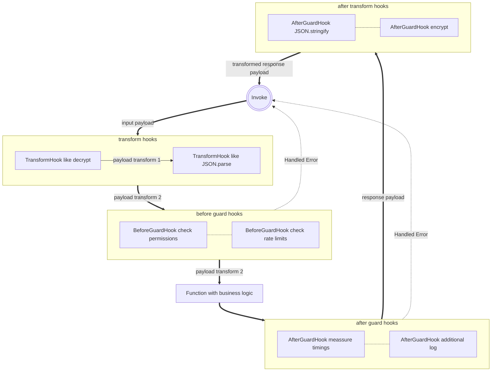

---
# This control sidebar index
index: 5
# This is the icon of the page
icon: anchor fas
# This is the title of the article
title: Hooks
# A page can have multiple tags
tag:
  - Guide
# this page is sticky in article list
sticky: true
# this page will appear in article channel in home page
star: true
---

# Hooks

Hooks are a powerful way to separate technical needs from business logic.  
There are two different types of hooks:

There are hooks with return value, which are able to take inputs, execute some logic and return a value.  
The returned value is then used as input for the next hook or the business function.  
These hooks are expected to not throw any error and called transform hooks.

On the other hand, there are hooks which do not return a value. The purpose is to only validate input data, and they are expected to throw HandledError.  
For better differentiation, hooks without return values called guard hooks.

## Service function hooks

**Example-flow:**



### BeforeTransformHook

This transform hook is called before input validation.  
It allows implementing migrations or decoding of input message payload without touching the main business logic.

A use case could be, that the message payload is encrypted and needs to be decrypted.  
Typically, anything like input schema migrations is also a good example for using transform hooks.

```typescript
import { BeforeTransformHook, FunctionDefinitionBuilder } from '@purista/core'
import { createDecipheriv } from 'crypto'

import { UserService } from '../../UserService'
import { inputParameterSchema, inputPayloadSchema, outputPayloadSchema } from './schema'
import { signUp } from './signUp'

const beforeTransformHook1: BeforeTransformHook<UserService> = async function(_logger, input, params) {
  return {
    params,
    payload: JSON.parse(input as string),
  }
}

const beforeTransformHook2: BeforeTransformHook<UserService> = async function(_logger, input, params) {
  const i = input as { iv: string; content: string }
  const p = params as { algorithm: string; secretKey: string }
  const decipher = createDecipheriv(p.algorithm, p.secretKey, Buffer.from(i.iv, 'hex'))

  const decrpyted = Buffer.concat([decipher.update(Buffer.from(i.content, 'hex')), decipher.final()])

  return {
    params,
    payload: decrpyted.toString(),
  }
}

export default new FunctionDefinitionBuilder('signUp', 'Sign up a new unknown user', signUp)
  .addInputSchema(inputPayloadSchema)
  .addParameterSchema(inputParameterSchema)
  .addOutputSchema(outputPayloadSchema)
  .exposeAsHttpEndpoint('POST', '/sign-up')
  .setBeforeTransformHook(beforeTransformHook1, beforeTransformHook2)


```

### BeforeGuardHook

The before guard hook is extremely useful for any use case where you need to validate authorization, rate limits and similar things.

This guard should throw a HandledError, if for example the user is not allowed to execute this function.

```typescript
import { BeforeGuardHook, FunctionDefinitionBuilder } from '@purista/core'

import { UserService } from '../../UserService'
import {
  inputParameterSchema,
  InputParameterType,
  inputPayloadSchema,
  InputPayloadType,
  outputPayloadSchema,
} from './schema'
import { signUp } from './signUp'

const beforeGuardHook1: BeforeGuardHook<UserService, InputPayloadType, InputParameterType> = async function(logger, input) {
  logger.debug('beforeGuardHook1', input.email)
}

const beforeGuardHook2: BeforeGuardHook<UserService, InputPayloadType, InputParameterType> = async function(logger, input) {
  logger.debug('beforeGuardHook2', input.password)
}

export default new FunctionDefinitionBuilder('signUp', 'Sign up a new unknown user', signUp)
  .addInputSchema(inputPayloadSchema)
  .addParameterSchema(inputParameterSchema)
  .addOutputSchema(outputPayloadSchema)
  .exposeAsHttpEndpoint('POST', '/sign-up')
  .setBeforeGuardHook(beforeGuardHook1, beforeGuardHook2)
```

### AfterGuardHook

This guard hook is called after response validation and before AfterTransformHook.  

There are not so much real use cases where it would make sense to use this hook.  
Example is additional logging and any kind of metrics.

It is also possible to use this hook for optimization purpose.  
As an example:

A function is making a financial transaction and returns the actual balance. You like to inform the user as soon as the balance is below a certain level.  
You could build a subscription which is listening for all responses of this function. Expecting that only 10% of function responses will result in informing the user, 90% of subscription invocations would waste resources.

<Badge text="Be aware" type="warning"/>

All hooks will need computation resources and because of this it will increase response time.  
Also keep in mind that, in case a hook fails, and it is throwing, the business information might be lost or can't be reproduced.

In the financial example, prefer a subscription or simply emit some custom event in the after guard hook instead of doing some time-consuming stuff.

```typescript
import { AfterGuardHook, FunctionDefinitionBuilder } from '@purista/core'

import { UserService } from '../../UserService'
import { inputParameterSchema, inputPayloadSchema, outputPayloadSchema, OutputPayloadType } from './schema'
import { signUp } from './signUp'

const afterGuardHook1: AfterGuardHook<UserService, OutputPayloadType> = async function(logger, result) {
  logger.debug('afterGuardHook1', result.uuid)
}

const afterGuardHook2: AfterGuardHook<UserService, OutputPayloadType> = async function(logger, result) {
  logger.debug('afterGuardHook2', result.uuid)
}

export default new FunctionDefinitionBuilder('signUp', 'Sign up a new unknown user', signUp)
  .addInputSchema(inputPayloadSchema)
  .addParameterSchema(inputParameterSchema)
  .addOutputSchema(outputPayloadSchema)
  .exposeAsHttpEndpoint('POST', '/sign-up')
  .setAfterGuardHook(afterGuardHook1, afterGuardHook2)

```

### AfterTransformHook

This transform hook is called after output validation.
It allows implementing migration or decoding or response payload without touching the main business logic.

Like the BeforeTransformHook, a good example could be the encryption of the response payload.

```typescript
import { AfterTransformHook, FunctionDefinitionBuilder } from '@purista/core'
import { createCipheriv, randomBytes } from 'crypto'

import { UserService } from '../../UserService'
import { inputParameterSchema, inputPayloadSchema, outputPayloadSchema, OutputPayloadType } from './schema'
import { signUp } from './signUp'

const afterTransformHook1: AfterTransformHook<UserService, OutputPayloadType> = async function (
  _logger,
  functionResult,
  _inputPayload,
  _params,
  _message,
) {
  return JSON.stringify(functionResult) as unknown
}

const afterTransformHook2: AfterTransformHook<
  UserService,
  string,
  unknown,
  { algorithm: string; secretKey: string }
> = async (_logger, functionResult, _inputPayload, params, _message) => {
  const iv = randomBytes(16)

  const cipher = createCipheriv(params.algorithm, params.secretKey, iv)

  const encrypted = Buffer.concat([cipher.update(functionResult as string), cipher.final()])

  return {
    iv,
    content: encrypted,
  }
}

export default new FunctionDefinitionBuilder('signUp', 'Sign up a new unknown user', signUp)
  .addInputSchema(inputPayloadSchema)
  .addParameterSchema(inputParameterSchema)
  .addOutputSchema(outputPayloadSchema)
  .exposeAsHttpEndpoint('POST', '/sign-up')
  .setAfterTransformHook(afterTransformHook1, afterTransformHook2)

```
